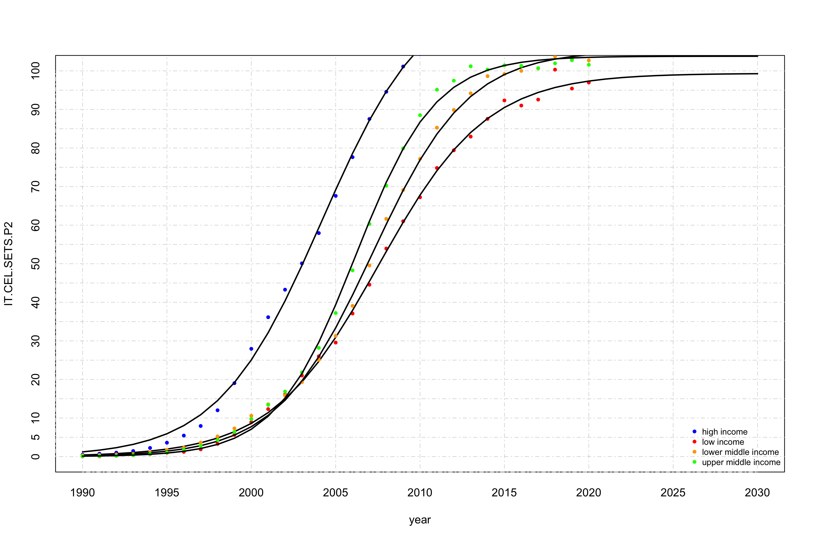
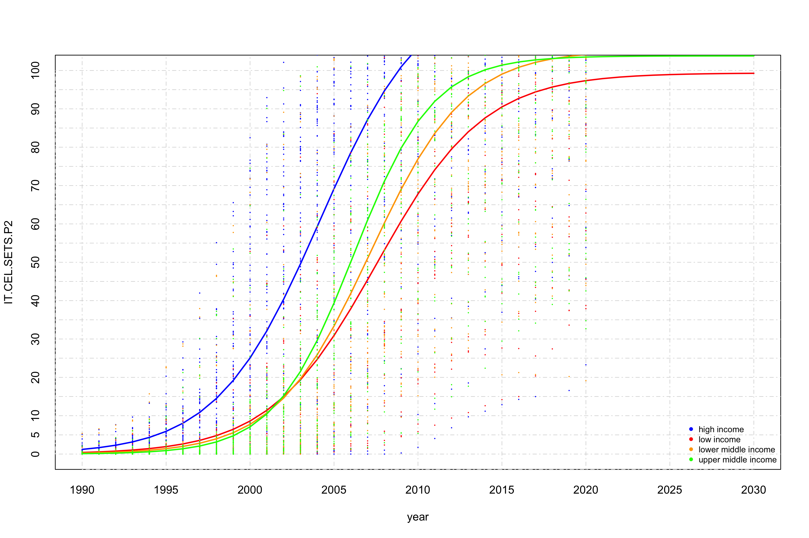

Linear and logist regression analysis to mobile phone
================
Geiser C. Challco <geiser@alumni.usp.br>

- <a href="#initial-variables-and-data"
  id="toc-initial-variables-and-data">Initial Variables and Data</a>
- <a href="#calculating-data-with-mean-values"
  id="toc-calculating-data-with-mean-values">Calculating data with mean
  values</a>
- <a href="#logistic-regression" id="toc-logistic-regression">Logistic
  Regression</a>
  - <a href="#logistic-regression-for-high-income-countries"
    id="toc-logistic-regression-for-high-income-countries">Logistic
    regression for high income countries</a>
  - <a href="#logistic-regression-for-upper-middle-income-countries"
    id="toc-logistic-regression-for-upper-middle-income-countries">Logistic
    regression for upper middle income countries</a>
  - <a href="#logistic-regression-for-lower-middle-income-countries"
    id="toc-logistic-regression-for-lower-middle-income-countries">Logistic
    regression for lower middle income countries</a>
  - <a href="#logistic-regression-for-low-income-countries"
    id="toc-logistic-regression-for-low-income-countries">Logistic
    regression for low income countries</a>
  - <a href="#summary-of-logistic-regression-with-average-values"
    id="toc-summary-of-logistic-regression-with-average-values">Summary of
    logistic regression with average values</a>

## Initial Variables and Data

``` r
dat <- read_excel("../data/API_IT.CEL.SETS.P2_DS2_en_excel_v2_4576197.xlsx", sheet = "Data")

lmdls <- c()
smdls <- c()

income_grp <- unique(dat$IncomeGroup)
(income_grp <- income_grp[!is.na(income_grp)])
```

    ## [1] "High income"         "Low income"          "Lower middle income"
    ## [4] "Upper middle income"

## Calculating data with mean values

``` r
df <- get_data(dat, income_grp[1], is.mean = T)
for (i in 2:length(income_grp)) {
  grp = income_grp[i]
  df <- merge(df, get_data(dat, grp, is.mean = T), by="year", suffixes = c(income_grp[i-1], grp))
}
colnames(df) <- c("year",income_grp)

knitr::kable(df)
```

| year | High income |  Low income | Lower middle income | Upper middle income |
|-----:|------------:|------------:|--------------------:|--------------------:|
| 1990 |   0.4720267 |   0.0341857 |           0.2983476 |           0.0698425 |
| 1991 |   0.7413528 |   0.0532294 |           0.4160510 |           0.1117510 |
| 1992 |   1.0154115 |   0.2317428 |           0.5392019 |           0.1939592 |
| 1993 |   1.4417537 |   0.3893643 |           0.7224413 |           0.3626198 |
| 1994 |   2.2431862 |   0.6072903 |           1.1281389 |           0.6479454 |
| 1995 |   3.5965177 |   0.9841094 |           1.7041172 |           1.0429057 |
| 1996 |   5.4475276 |   1.2302866 |           2.2959269 |           1.7730808 |
| 1997 |   7.9349174 |   1.8882986 |           3.6324252 |           2.7910198 |
| 1998 |  12.0075839 |   3.3046290 |           5.2370622 |           4.3072315 |
| 1999 |  19.0359540 |   5.6301230 |           7.2997731 |           6.3958099 |
| 2000 |  27.9441698 |   8.9050889 |          10.5895913 |           9.7271744 |
| 2001 |  36.1371733 |  12.3144000 |          13.5539866 |          13.4122794 |
| 2002 |  43.2715914 |  16.0722620 |          15.8539962 |          16.8583379 |
| 2003 |  50.0912351 |  21.0129697 |          19.2949075 |          21.8297023 |
| 2004 |  57.9449490 |  26.0003979 |          25.0848138 |          28.1885642 |
| 2005 |  67.5891899 |  29.5584226 |          31.2902850 |          37.2134453 |
| 2006 |  77.6316983 |  37.0941151 |          39.0762851 |          48.2834524 |
| 2007 |  87.5277265 |  44.5594047 |          49.5492727 |          60.3193971 |
| 2008 |  94.5824923 |  53.9405409 |          61.6317681 |          70.2165692 |
| 2009 | 101.1339105 |  61.0146535 |          69.1268970 |          79.9038620 |
| 2010 | 104.3421858 |  67.2279592 |          77.1896253 |          88.5169624 |
| 2011 | 108.0011118 |  74.8257519 |          85.2787142 |          95.1240104 |
| 2012 | 114.0853813 |  79.4030189 |          89.8750390 |          97.4696331 |
| 2013 | 116.9319141 |  82.9608807 |          94.1851825 |         101.1950511 |
| 2014 | 117.5600409 |  87.5544805 |          98.6321839 |         100.3330119 |
| 2015 | 118.6092015 |  92.3386877 |          99.1880761 |         101.4386248 |
| 2016 | 119.3501223 |  91.0122828 |         100.0019930 |         101.3064700 |
| 2017 | 119.9418158 |  92.5595097 |         100.6331102 |         100.6980367 |
| 2018 | 120.8368023 | 100.3173722 |         103.7584948 |         101.9577754 |
| 2019 | 121.8291920 |  95.4199055 |         102.9824931 |         102.7639856 |
| 2020 | 121.4358323 |  96.9882107 |         102.7218583 |         101.5822610 |
| 2021 |         NaN |         NaN |                 NaN |                 NaN |

## Logistic Regression

### Logistic regression for high income countries

``` r
grp = income_grp[1]
dat2 <- get_data(dat, grp)

fit <- nls(IT.CEL.SETS.P2 ~ SSlogis(year, Asym, xmid, scal), data=dat2)
smdls[[grp]] <- fit
summary(fit)
```

    ## 
    ## Formula: IT.CEL.SETS.P2 ~ SSlogis(year, Asym, xmid, scal)
    ## 
    ## Parameters:
    ##       Estimate Std. Error  t value Pr(>|t|)    
    ## Asym  122.0446     1.6540    73.79   <2e-16 ***
    ## xmid 2004.1719     0.1856 10795.97   <2e-16 ***
    ## scal    3.0817     0.1522    20.25   <2e-16 ***
    ## ---
    ## Signif. codes:  0 '***' 0.001 '**' 0.01 '*' 0.05 '.' 0.1 ' ' 1
    ## 
    ## Residual standard error: 33.44 on 2268 degrees of freedom
    ## 
    ## Number of iterations to convergence: 2 
    ## Achieved convergence tolerance: 1.29e-06

``` r
R2nls(fit)
```

    ## $PseudoR2
    ## [1] 0.6725223
    ## 
    ## $R2
    ## [1] 0.6598708

``` r
pyear <- seq(min(dat2$year), 2030, 1)
plot(dat2, xlim = c(min(pyear), max(pyear)), ylim = c(0,140),
     pch=16, col="blue", main = grp, xaxt='n',yaxt='n', cex = 0.5)
axis(1, at = seq(min(pyear), max(pyear), 1), tck = 1, lty = 4, col = "lightgray", lwd = 0.75)
axis(2, at = seq(0, 140, 10), tck = 1, lty = 4, col = "lightgray", lwd = 0.75)

matlines(pyear, predict(fit, newdata=list(year=pyear), interval="confidence"), lwd=1.25)
```

<!-- -->

### Logistic regression for upper middle income countries

``` r
grp = income_grp[4]
dat2 <- get_data(dat, grp)

fit <- nls(IT.CEL.SETS.P2 ~ SSlogis(year, Asym, xmid, scal), data=dat2)
smdls[[grp]] <- fit
summary(fit)
```

    ## 
    ## Formula: IT.CEL.SETS.P2 ~ SSlogis(year, Asym, xmid, scal)
    ## 
    ## Parameters:
    ##       Estimate Std. Error  t value Pr(>|t|)    
    ## Asym  103.8021     1.4187    73.17   <2e-16 ***
    ## xmid 2006.1631     0.1577 12725.07   <2e-16 ***
    ## scal    2.3597     0.1312    17.99   <2e-16 ***
    ## ---
    ## Signif. codes:  0 '***' 0.001 '**' 0.01 '*' 0.05 '.' 0.1 ' ' 1
    ## 
    ## Residual standard error: 25.01 on 1649 degrees of freedom
    ## 
    ## Number of iterations to convergence: 2 
    ## Achieved convergence tolerance: 2.834e-06

``` r
R2nls(fit)
```

    ## $PseudoR2
    ## [1] 0.7461331
    ## 
    ## $R2
    ## [1] 0.7557133

``` r
pyear <- seq(min(dat2$year), 2030, 1)
plot(dat2, xlim = c(min(pyear), max(pyear)), ylim = c(0,140),
     pch=16, col="blue", main = grp, xaxt='n',yaxt='n', cex = 0.5)
axis(1, at = seq(min(pyear), max(pyear), 1), tck = 1, lty = 4, col = "lightgray", lwd = 0.75)
axis(2, at = seq(0, 140, 10), tck = 1, lty = 4, col = "lightgray", lwd = 0.75)

matlines(pyear, predict(fit, newdata=list(year=pyear), interval="confidence"), lwd=1.25)
```

<!-- -->

### Logistic regression for lower middle income countries

``` r
grp = income_grp[3]
dat2 <- get_data(dat, grp)

fit <- nls(IT.CEL.SETS.P2 ~ SSlogis(year, Asym, xmid, scal), data=dat2)
smdls[[grp]] <- fit
summary(fit)
```

    ## 
    ## Formula: IT.CEL.SETS.P2 ~ SSlogis(year, Asym, xmid, scal)
    ## 
    ## Parameters:
    ##       Estimate Std. Error t value Pr(>|t|)    
    ## Asym  105.3133     1.9229   54.77   <2e-16 ***
    ## xmid 2007.1758     0.2110 9513.78   <2e-16 ***
    ## scal    2.8334     0.1686   16.80   <2e-16 ***
    ## ---
    ## Signif. codes:  0 '***' 0.001 '**' 0.01 '*' 0.05 '.' 0.1 ' ' 1
    ## 
    ## Residual standard error: 26.78 on 1577 degrees of freedom
    ## 
    ## Number of iterations to convergence: 2 
    ## Achieved convergence tolerance: 1.376e-06

``` r
R2nls(fit)
```

    ## $PseudoR2
    ## [1] 0.7025343
    ## 
    ## $R2
    ## [1] 0.71155

``` r
pyear <- seq(min(dat2$year), 2030, 1)
plot(dat2, xlim = c(min(pyear), max(pyear)), ylim = c(0,140),
     pch=16, col="blue", main = grp, xaxt='n',yaxt='n', cex = 0.5)
axis(1, at = seq(min(pyear), max(pyear), 1), tck = 1, lty = 4, col = "lightgray", lwd = 0.75)
axis(2, at = seq(0, 140, 10), tck = 1, lty = 4, col = "lightgray", lwd = 0.75)

matlines(pyear, predict(fit, newdata=list(year=pyear), interval="confidence"), lwd=1.25)
```

<!-- -->

### Logistic regression for low income countries

``` r
grp = income_grp[2]
dat2 <- get_data(dat, grp)

fit <- nls(IT.CEL.SETS.P2 ~ SSlogis(year, Asym, xmid, scal), data=dat2)
smdls[[grp]] <- fit
summary(fit)
```

    ## 
    ## Formula: IT.CEL.SETS.P2 ~ SSlogis(year, Asym, xmid, scal)
    ## 
    ## Parameters:
    ##       Estimate Std. Error  t value Pr(>|t|)    
    ## Asym   99.3575     3.6853   26.960   <2e-16 ***
    ## xmid 2007.5478     0.4337 4628.602   <2e-16 ***
    ## scal    3.2046     0.3272    9.795   <2e-16 ***
    ## ---
    ## Signif. codes:  0 '***' 0.001 '**' 0.01 '*' 0.05 '.' 0.1 ' ' 1
    ## 
    ## Residual standard error: 30.35 on 788 degrees of freedom
    ## 
    ## Number of iterations to convergence: 1 
    ## Achieved convergence tolerance: 5.193e-06

``` r
R2nls(fit)
```

    ## $PseudoR2
    ## [1] 0.6035689
    ## 
    ## $R2
    ## [1] 0.5966871

``` r
pyear <- seq(min(dat2$year), 2030, 1)
plot(dat2, xlim = c(min(pyear), max(pyear)), ylim = c(0,140),
     pch=16, col="blue", main = grp, xaxt='n',yaxt='n', cex = 0.5)
axis(1, at = seq(min(pyear), max(pyear), 1), tck = 1, lty = 4, col = "lightgray", lwd = 0.75)
axis(2, at = seq(0, 140, 10), tck = 1, lty = 4, col = "lightgray", lwd = 0.75)

matlines(pyear, predict(fit, newdata=list(year=pyear), interval="confidence"), lwd=1.25)
```

<!-- -->

### Summary of logistic regression with average values

``` r
pyear <- seq(1990, 2030, 1)
plot(x=pyear, y=c(), xlim = c(min(pyear), max(pyear)), ylim=c(0,140),
     ylab = "IT.CEL.SETS.P2", xlab = "year", xaxt='n',yaxt='n')
axis(1, at = seq(min(pyear),max(pyear), 1), tck = 1, lty = 4, col = "lightgray", lwd = 0.75)
axis(2, at = seq(0, 140, 10), tck = 1, lty = 4, col = "lightgray", lwd = 0.75)

colors <- c("blue","red","orange","green")
names(colors) <- income_grp
for (grp in income_grp) {
  gdat <- get_data(dat, grp, is.mean = T)
  points(x=gdat$year, y=gdat$IT.CEL.SETS.P2, pch=16, col=colors[grp], xaxt='n', yaxt='n', cex=0.75)
  matlines(pyear, predict(smdls[[grp]], newdata=list(year=pyear), interval="confidence"), lwd=1)
}
legend("bottomright", legend=c("high income","low income","lower middle income","upper middle income"),
       col=colors, lty=0,  cex = 0.75, bg = "transparent", pch=16, box.lty=0)
```

<!-- -->

``` r
pyear <- seq(1990, 2030, 1)
plot(x=pyear, y=c(), xlim = c(min(pyear), max(pyear)), ylim=c(0,140),
     ylab = "IT.CEL.SETS.P2", xlab = "year", xaxt='n',yaxt='n')
axis(1, at = seq(min(pyear),max(pyear), 1), tck = 1, lty = 4, col = "lightgray", lwd = 0.75)
axis(2, at = seq(0, 140, 10), tck = 1, lty = 4, col = "lightgray", lwd = 0.75)

colors <- c("blue","red","orange","green")
names(colors) <- income_grp
for (grp in income_grp) {
  gdat <- get_data(dat, grp, is.mean = F)
  points(x=gdat$year, y=gdat$IT.CEL.SETS.P2, pch=16, col=colors[grp], xaxt='n', yaxt='n', cex=0.25)
  matlines(pyear, col = colors[grp], predict(smdls[[grp]], newdata=list(year=pyear), interval="confidence"), lwd=1)
}
legend("bottomright", legend=c("high income","low income","lower middle income","upper middle income"),
       col=colors, lty=0,  cex = 0.75, bg = "transparent", pch=16, box.lty=0)
```

<!-- -->
