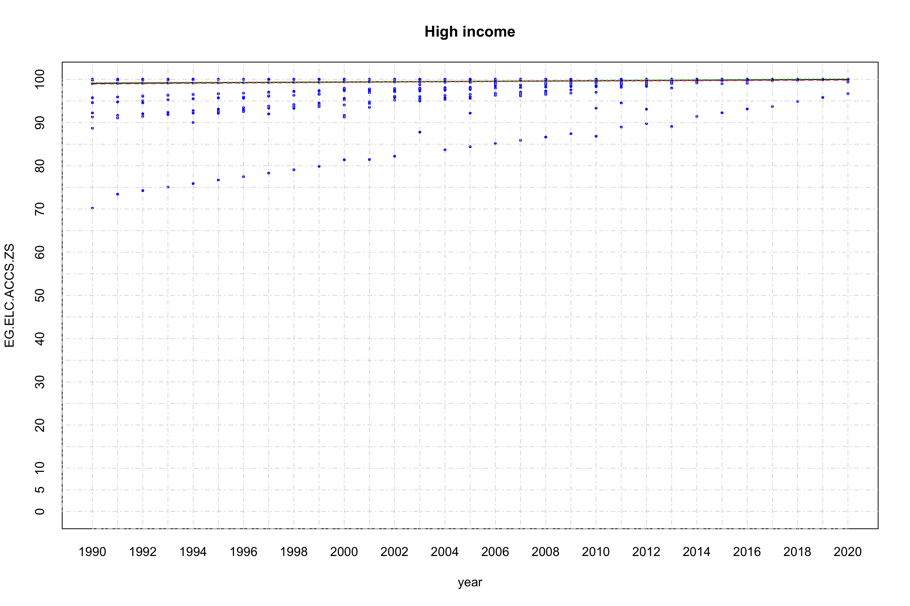
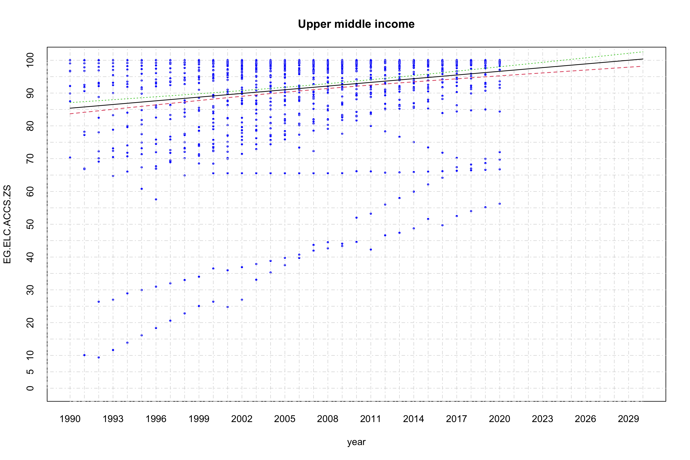
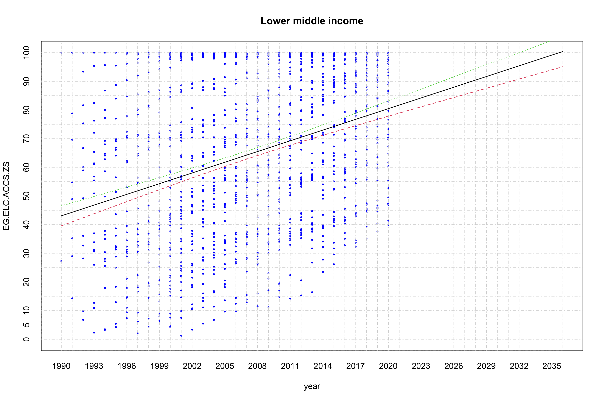
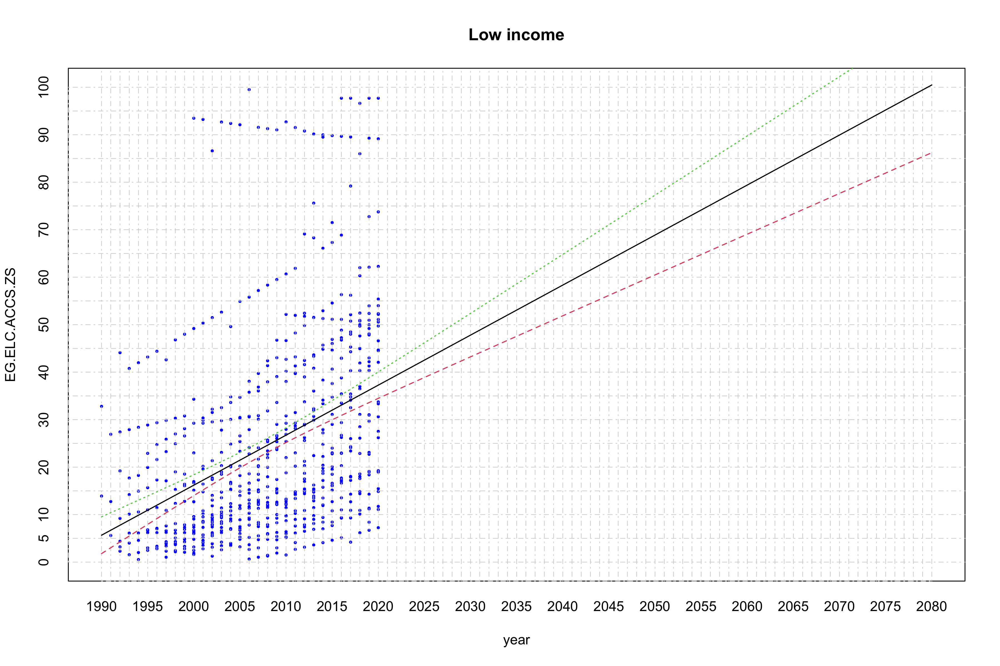
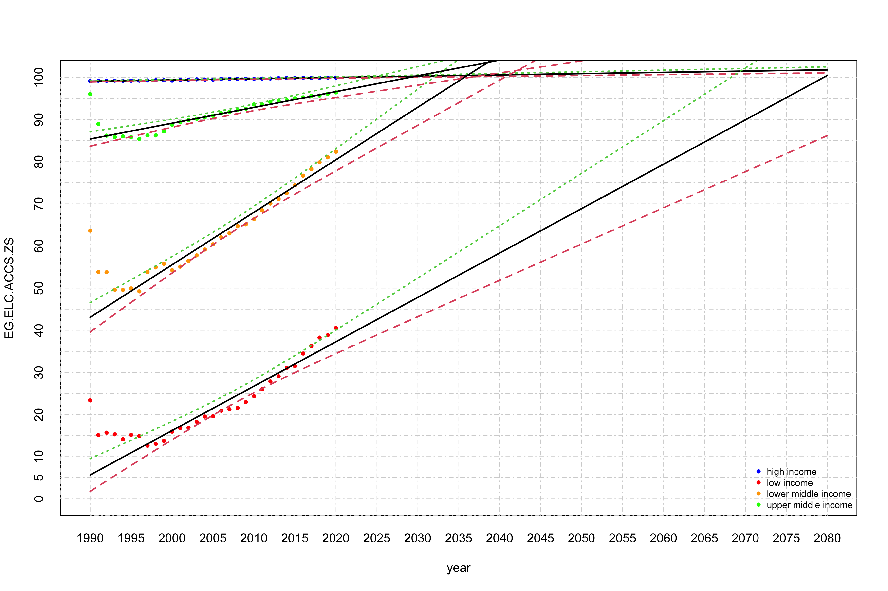
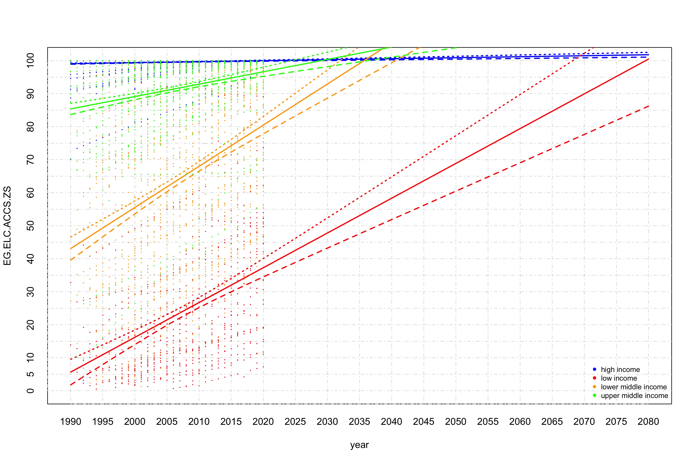

Linear regression for access to electricity
================
Geiser C. Challco <geiser@alumni.usp.br>

- <a href="#initial-variables-and-data"
  id="toc-initial-variables-and-data">Initial Variables and Data</a>
- <a href="#calculating-data-with-mean-values"
  id="toc-calculating-data-with-mean-values">Calculating data with mean
  values</a>
- <a href="#linear-regression" id="toc-linear-regression">Linear
  Regression</a>
  - <a href="#linear-regression-for-high-income-countries"
    id="toc-linear-regression-for-high-income-countries">Linear regression
    for high income countries</a>
  - <a href="#linear-regression-for-upper-middle-income-countries"
    id="toc-linear-regression-for-upper-middle-income-countries">Linear
    regression for upper middle income countries</a>
  - <a href="#linear-regression-for-lower-middle-income-countries"
    id="toc-linear-regression-for-lower-middle-income-countries">Linear
    regression for lower middle income countries</a>
  - <a href="#linear-regression-for-low-income-countries"
    id="toc-linear-regression-for-low-income-countries">Linear regression
    for low income countries</a>
  - <a href="#summary-of-linear-regression-with-average-values"
    id="toc-summary-of-linear-regression-with-average-values">Summary of
    linear regression with average values</a>

## Initial Variables and Data

``` r
dat <- read_excel("../data/API_EG.ELC.ACCS.ZS_DS2_en_excel_v2_4683862.xlsx", sheet = "Data")

lmdls <- c()
smdls <- c()

income_grp <- unique(dat$IncomeGroup)
(income_grp <- income_grp[!is.na(income_grp)])
```

    ## [1] "High income"         "Low income"          "Lower middle income"
    ## [4] "Upper middle income"

## Calculating data with mean values

``` r
df <- get_data(dat, income_grp[1], is.mean = T)
for (i in 2:length(income_grp)) {
  grp = income_grp[i]
  df <- merge(df, get_data(dat, grp, is.mean = T), by="year", suffixes = c(income_grp[i-1], grp))
}
colnames(df) <- c("year",income_grp)

knitr::kable(df)
```

| year | High income | Low income | Lower middle income | Upper middle income |
|-----:|------------:|-----------:|--------------------:|--------------------:|
| 1990 |    99.10199 |   23.35000 |            63.65000 |            96.01950 |
| 1991 |    99.21003 |   15.09067 |            53.82680 |            88.95011 |
| 1992 |    99.19732 |   15.68694 |            53.76249 |            86.19343 |
| 1993 |    99.23813 |   15.29456 |            49.63343 |            85.86996 |
| 1994 |    99.16340 |   14.15194 |            49.57215 |            86.03713 |
| 1995 |    99.22261 |   15.15143 |            49.92284 |            85.84494 |
| 1996 |    99.24002 |   14.85500 |            49.23306 |            85.42621 |
| 1997 |    99.28015 |   12.58649 |            53.82153 |            86.25882 |
| 1998 |    99.33566 |   13.05446 |            54.91843 |            86.24721 |
| 1999 |    99.35931 |   13.75936 |            55.78773 |            87.20217 |
| 2000 |    99.24347 |   15.94527 |            54.27297 |            88.75130 |
| 2001 |    99.38519 |   16.80856 |            55.09441 |            89.34005 |
| 2002 |    99.48201 |   16.86952 |            56.44838 |            89.84500 |
| 2003 |    99.54225 |   18.29577 |            57.76037 |            90.19288 |
| 2004 |    99.49103 |   19.52121 |            59.15523 |            90.51820 |
| 2005 |    99.44299 |   19.59689 |            60.38082 |            90.91990 |
| 2006 |    99.65271 |   20.91723 |            62.04788 |            91.50986 |
| 2007 |    99.63042 |   21.25589 |            62.98835 |            91.79331 |
| 2008 |    99.64715 |   21.54680 |            64.68119 |            92.25988 |
| 2009 |    99.69208 |   22.94474 |            65.13752 |            92.58804 |
| 2010 |    99.64945 |   24.34951 |            66.37793 |            93.58422 |
| 2011 |    99.72597 |   25.99990 |            68.47653 |            93.59923 |
| 2012 |    99.73657 |   27.84684 |            70.07289 |            94.17355 |
| 2013 |    99.80751 |   29.07489 |            71.13184 |            94.42796 |
| 2014 |    99.87014 |   31.09127 |            72.54297 |            94.63824 |
| 2015 |    99.88399 |   31.46880 |            74.39249 |            95.03184 |
| 2016 |    99.89472 |   34.48254 |            76.70291 |            95.25532 |
| 2017 |    99.91250 |   36.25829 |            78.24353 |            95.58699 |
| 2018 |    99.93321 |   38.25665 |            79.85167 |            95.69476 |
| 2019 |    99.94645 |   38.81830 |            81.04181 |            96.09911 |
| 2020 |    99.95131 |   40.53946 |            82.38932 |            96.43729 |
| 2021 |         NaN |        NaN |                 NaN |                 NaN |

## Linear Regression

### Linear regression for high income countries

``` r
grp = income_grp[1]
dat2 <- get_data(dat, grp)

fit <- lm(EG.ELC.ACCS.ZS ~ year, data=dat2)
smdls[[grp]] <- fit
summary(fit)
```

    ## 
    ## Call:
    ## lm(formula = EG.ELC.ACCS.ZS ~ year, data = dat2)
    ## 
    ## Residuals:
    ##      Min       1Q   Median       3Q      Max 
    ## -28.9039   0.1559   0.3959   0.6660   0.9061 
    ## 
    ## Coefficients:
    ##              Estimate Std. Error t value Pr(>|t|)    
    ## (Intercept) 39.379176   9.810203   4.014 6.15e-05 ***
    ## year         0.030007   0.004893   6.133 1.00e-09 ***
    ## ---
    ## Signif. codes:  0 '***' 0.001 '**' 0.01 '*' 0.05 '.' 0.1 ' ' 1
    ## 
    ## Residual standard error: 2.166 on 2462 degrees of freedom
    ## Multiple R-squared:  0.01505,    Adjusted R-squared:  0.01465 
    ## F-statistic: 37.62 on 1 and 2462 DF,  p-value: 1.001e-09

``` r
pyear <- seq(min(dat2$year), 2020, 1)
plot(dat2, xlim = c(min(pyear), max(pyear)), ylim = c(0,100),
     pch=16, col="blue", main = grp, xaxt='n',yaxt='n', cex = 0.5)
axis(1, at = seq(min(pyear), max(pyear), 1), tck = 1, lty = 4, col = "lightgray", lwd = 0.75)
axis(2, at = seq(0, 100, 5), tck = 1, lty = 4, col = "lightgray", lwd = 0.75)

matlines(pyear, predict(fit, newdata=list(year=pyear), interval="confidence"), lwd=1.25)
```

<!-- -->

### Linear regression for upper middle income countries

``` r
grp = income_grp[4]
dat2 <- get_data(dat, grp)

fit <- lm(EG.ELC.ACCS.ZS ~ year, data=dat2)
smdls[[grp]] <- fit
summary(fit)
```

    ## 
    ## Call:
    ## lm(formula = EG.ELC.ACCS.ZS ~ year, data = dat2)
    ## 
    ## Residuals:
    ##     Min      1Q  Median      3Q     Max 
    ## -76.740  -2.563   4.487   7.295  14.611 
    ## 
    ## Coefficients:
    ##               Estimate Std. Error t value Pr(>|t|)    
    ## (Intercept) -660.41950   92.25268  -7.159 1.32e-12 ***
    ## year           0.37478    0.04596   8.154 7.87e-16 ***
    ## ---
    ## Signif. codes:  0 '***' 0.001 '**' 0.01 '*' 0.05 '.' 0.1 ' ' 1
    ## 
    ## Residual standard error: 13.93 on 1376 degrees of freedom
    ## Multiple R-squared:  0.04609,    Adjusted R-squared:  0.0454 
    ## F-statistic: 66.48 on 1 and 1376 DF,  p-value: 7.872e-16

``` r
pyear <- seq(min(dat2$year), 2030, 1)
plot(dat2, xlim = c(min(pyear), max(pyear)), ylim = c(0,100),
     pch=16, col="blue", main = grp, xaxt='n',yaxt='n', cex = 0.5)
axis(1, at = seq(min(pyear), max(pyear), 1), tck = 1, lty = 4, col = "lightgray", lwd = 0.75)
axis(2, at = seq(0, 100, 5), tck = 1, lty = 4, col = "lightgray", lwd = 0.75)

matlines(pyear, predict(fit, newdata=list(year=pyear), interval="confidence"), lwd=1.25)
```

<!-- -->

### Linear regression for lower middle income countries

``` r
grp = income_grp[3]
dat2 <- get_data(dat, grp)

fit <- lm(EG.ELC.ACCS.ZS ~ year, data=dat2)
smdls[[grp]] <- fit
summary(fit)
```

    ## 
    ## Call:
    ## lm(formula = EG.ELC.ACCS.ZS ~ year, data = dat2)
    ## 
    ## Residuals:
    ##     Min      1Q  Median      3Q     Max 
    ## -55.556 -20.314   1.753  21.068  56.927 
    ## 
    ## Coefficients:
    ##               Estimate Std. Error t value Pr(>|t|)    
    ## (Intercept) -2.437e+03  1.855e+02  -13.14   <2e-16 ***
    ## year         1.246e+00  9.239e-02   13.49   <2e-16 ***
    ## ---
    ## Signif. codes:  0 '***' 0.001 '**' 0.01 '*' 0.05 '.' 0.1 ' ' 1
    ## 
    ## Residual standard error: 26.15 on 1357 degrees of freedom
    ## Multiple R-squared:  0.1183, Adjusted R-squared:  0.1176 
    ## F-statistic:   182 on 1 and 1357 DF,  p-value: < 2.2e-16

``` r
pyear <- seq(min(dat2$year), 2036, 1)
plot(dat2, xlim = c(min(pyear), max(pyear)), ylim = c(0,100),
     pch=16, col="blue", main = grp, xaxt='n',yaxt='n', cex = 0.5)
axis(1, at = seq(min(pyear), max(pyear), 1), tck = 1, lty = 4, col = "lightgray", lwd = 0.75)
axis(2, at = seq(0, 100, 5), tck = 1, lty = 4, col = "lightgray", lwd = 0.75)

matlines(pyear, predict(fit, newdata=list(year=pyear), interval="confidence"), lwd=1.25)
```

<!-- -->

### Linear regression for low income countries

``` r
grp = income_grp[2]
dat2 <- get_data(dat, grp)

fit <- lm(EG.ELC.ACCS.ZS ~ year, data=dat2)
smdls[[grp]] <- fit
summary(fit)
```

    ## 
    ## Call:
    ## lm(formula = EG.ELC.ACCS.ZS ~ year, data = dat2)
    ## 
    ## Residuals:
    ##     Min      1Q  Median      3Q     Max 
    ## -30.026 -13.209  -5.467  10.185  77.288 
    ## 
    ## Coefficients:
    ##               Estimate Std. Error t value Pr(>|t|)    
    ## (Intercept) -2090.9405   201.7137  -10.37   <2e-16 ***
    ## year            1.0536     0.1004   10.49   <2e-16 ***
    ## ---
    ## Signif. codes:  0 '***' 0.001 '**' 0.01 '*' 0.05 '.' 0.1 ' ' 1
    ## 
    ## Residual standard error: 19.74 on 664 degrees of freedom
    ## Multiple R-squared:  0.1421, Adjusted R-squared:  0.1408 
    ## F-statistic:   110 on 1 and 664 DF,  p-value: < 2.2e-16

``` r
pyear <- seq(min(dat2$year), 2080, 1)
plot(dat2, xlim = c(min(pyear), max(pyear)), ylim = c(0,100),
     pch=16, col="blue", main = grp, xaxt='n',yaxt='n', cex = 0.5)
axis(1, at = seq(min(pyear), max(pyear), 1), tck = 1, lty = 4, col = "lightgray", lwd = 0.75)
axis(2, at = seq(0, 100, 5), tck = 1, lty = 4, col = "lightgray", lwd = 0.75)

matlines(pyear, predict(fit, newdata=list(year=pyear), interval="confidence"), lwd=1.25)
```

<!-- -->

### Summary of linear regression with average values

``` r
pyear <- seq(1990, 2080, 1)
plot(x=pyear, y=c(), xlim = c(min(pyear), max(pyear)), ylim=c(0,100),
     ylab = "EG.ELC.ACCS.ZS", xlab = "year", xaxt='n',yaxt='n')
axis(1, at = seq(min(pyear),max(pyear), 5), tck = 1, lty = 4, col = "lightgray", lwd = 0.75)
axis(2, at = seq(0, 100, 5), tck = 1, lty = 4, col = "lightgray", lwd = 0.75)

colors <- c("blue","red","orange","green")
names(colors) <- income_grp
for (grp in income_grp) {
  gdat <- get_data(dat, grp, is.mean = T)
  points(x=gdat$year, y=gdat$EG.ELC.ACCS.ZS, pch=16, col=colors[grp], xaxt='n', yaxt='n', cex=0.75)
  matlines(pyear, predict(smdls[[grp]], newdata=list(year=pyear), interval="confidence"), lwd=1)
}
legend("bottomright", legend=c("high income","low income","lower middle income","upper middle income"),
       col=colors, lty=0,  cex = 0.75, bg = "transparent", pch=16, box.lty=0)
```

<!-- -->

``` r
pyear <- seq(1990, 2080, 1)
plot(x=pyear, y=c(), xlim = c(min(pyear), max(pyear)), ylim=c(0,100),
     ylab = "EG.ELC.ACCS.ZS", xlab = "year", xaxt='n',yaxt='n')
axis(1, at = seq(min(pyear),max(pyear), 5), tck = 1, lty = 4, col = "lightgray", lwd = 0.75)
axis(2, at = seq(0, 100, 5), tck = 1, lty = 4, col = "lightgray", lwd = 0.75)

colors <- c("blue","red","orange","green")
names(colors) <- income_grp
for (grp in income_grp) {
  gdat <- get_data(dat, grp, is.mean = F)
  points(x=gdat$year, y=gdat$EG.ELC.ACCS.ZS, pch=16, col=colors[grp], xaxt='n', yaxt='n', cex=0.25)
  matlines(pyear, col = colors[grp], predict(smdls[[grp]], newdata=list(year=pyear), interval="confidence"), lwd=1)
}
legend("bottomright", legend=c("high income","low income","lower middle income","upper middle income"),
       col=colors, lty=0,  cex = 0.75, bg = "transparent", pch=16, box.lty=0)
```

<!-- -->
