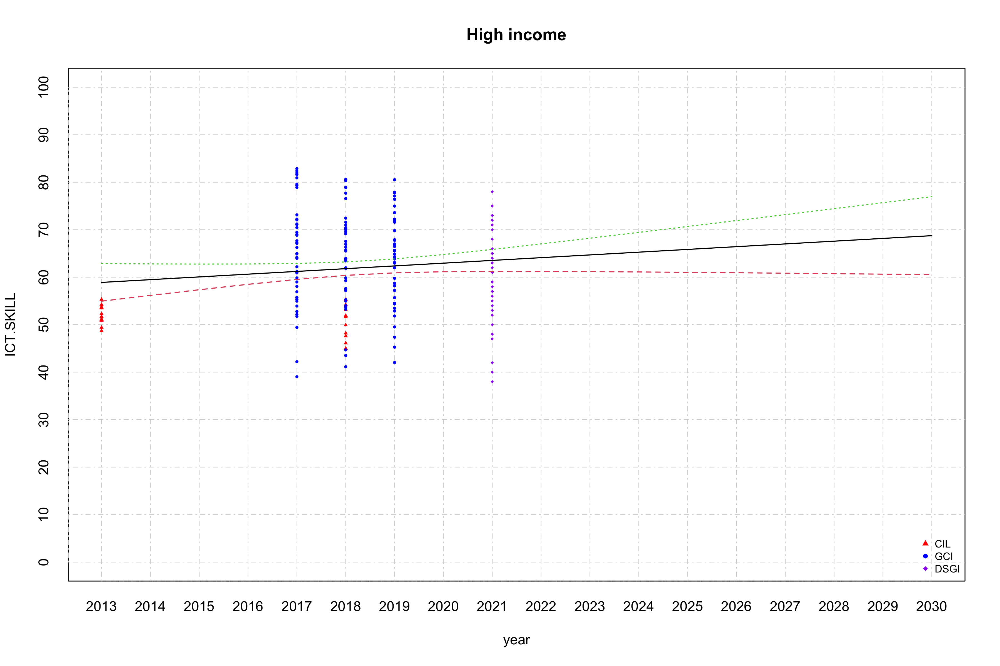
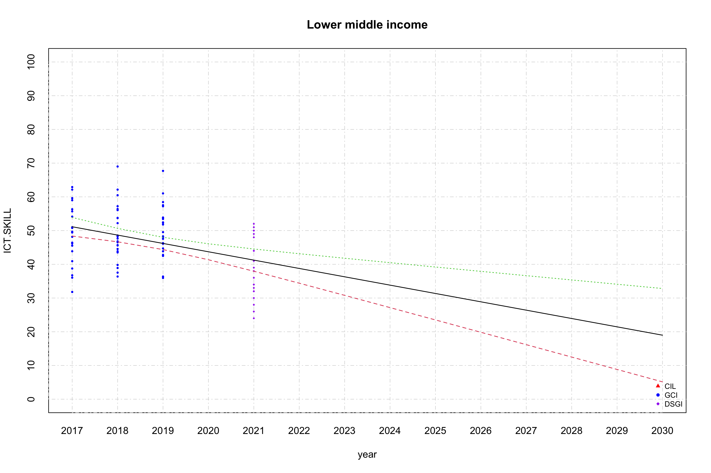
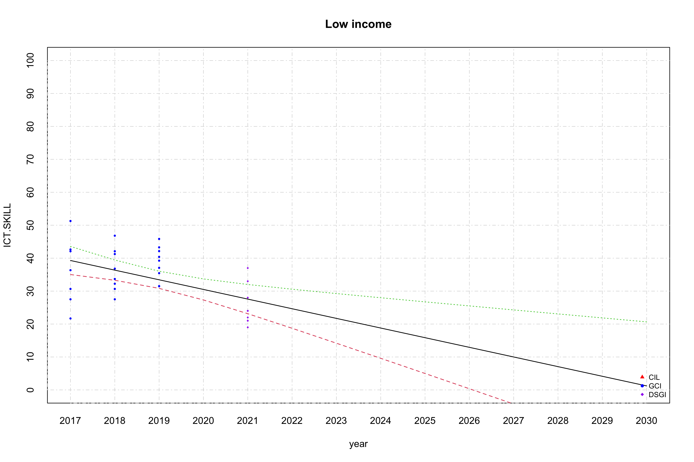
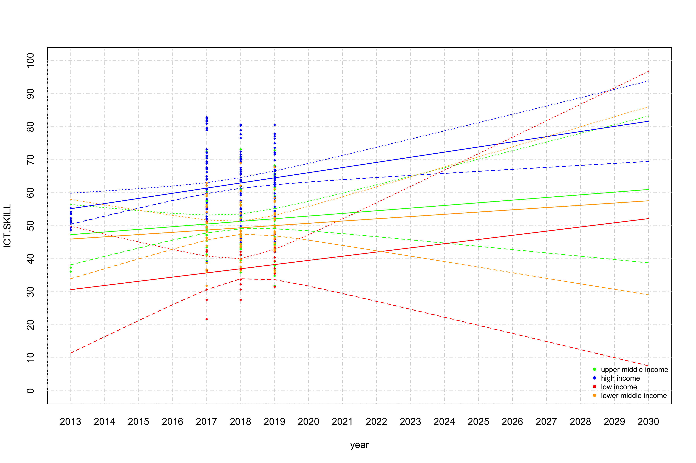

Linear regression for Information and Comunication Technology (ICT)
Skill
================
Geiser C. Challco <geiser@alumni.usp.br>

- <a href="#initial-variables-and-data"
  id="toc-initial-variables-and-data">Initial Variables and Data</a>
  - <a href="#getting-dsgi" id="toc-getting-dsgi">getting DSGI</a>
  - <a href="#getting-gci-40-digital-skills"
    id="toc-getting-gci-40-digital-skills">getting GCI 4.0 (Digital
    Skills)</a>
  - <a href="#getting-cil-icils" id="toc-getting-cil-icils">getting CIL
    (ICILS)</a>
- <a href="#calculating-data-with-mean-values"
  id="toc-calculating-data-with-mean-values">Calculating data with mean
  values</a>
- <a href="#linear-regression" id="toc-linear-regression">Linear
  Regression</a>
  - <a href="#linear-regression-for-high-income-countries"
    id="toc-linear-regression-for-high-income-countries">Linear regression
    for high income countries</a>
  - <a href="#linear-regression-for-upper-middle-income-countries"
    id="toc-linear-regression-for-upper-middle-income-countries">Linear
    regression for upper middle income countries</a>
  - <a href="#linear-regression-for-lower-middle-income-countries"
    id="toc-linear-regression-for-lower-middle-income-countries">Linear
    regression for lower middle income countries</a>
  - <a href="#linear-regression-for-low-income-countries"
    id="toc-linear-regression-for-low-income-countries">Linear regression
    for low income countries</a>
  - <a href="#summary-of-linear-regression-with-average-values"
    id="toc-summary-of-linear-regression-with-average-values">Summary of
    linear regression with average values</a>

## Initial Variables and Data

``` r
mtd.df <- read_excel("../data/ICT_and_Digital_Skill.xlsx", sheet = "metadata")
GCI.df <- read_excel("../data/ICT_and_Digital_Skill.xlsx", sheet = "Digital Skill value")
DSGI.df <- read_excel("../data/ICT_and_Digital_Skill.xlsx", sheet = "DSGI-2021")
CIL.df <- read_excel("../data/ICT_and_Digital_Skill.xlsx", sheet = "ICILS (CIL)")
```

### getting DSGI

``` r
dsgi.idx <- which(mtd.df$`Indicator Id`=="DSGI")
dsgi.val <- 100*(DSGI.df$DSGI - mtd.df$min[dsgi.idx])/(mtd.df$max[dsgi.idx] - mtd.df$min[dsgi.idx])

dat <- data.frame(country=DSGI.df$Country,value=dsgi.val,year=2021,IncomeGroup=DSGI.df$IncomeGroup, indicator="DSGI")
```

### getting GCI 4.0 (Digital Skills)

``` r
gci.idx <-which(mtd.df$`Indicator Id`=="41400")
gci.val <- 100*(GCI.df$`2017` - mtd.df$min[gci.idx])/(mtd.df$max[gci.idx] - mtd.df$min[gci.idx])

dat <- rbind(
  dat,
  data.frame(country=GCI.df$`Country Name`,value=gci.val,year=2017,IncomeGroup=GCI.df$IncomeGroup, indicator="GCI")
)

gci.val <- 100*(GCI.df$`2018` - mtd.df$min[gci.idx])/(mtd.df$max[gci.idx] - mtd.df$min[gci.idx])

dat <- rbind(
  dat,
  data.frame(country=GCI.df$`Country Name`,value=gci.val,year=2018,IncomeGroup=GCI.df$IncomeGroup, indicator="GCI")
)

gci.val <- 100*(GCI.df$`2019` - mtd.df$min[gci.idx])/(mtd.df$max[gci.idx] - mtd.df$min[gci.idx])

dat <- rbind(
  dat,
  data.frame(country=GCI.df$`Country Name`,value=gci.val,year=2019,IncomeGroup=GCI.df$IncomeGroup, indicator="GCI")
)
```

### getting CIL (ICILS)

``` r
cli.idx <-which(mtd.df$`Indicator Id`=="CIL")
cli.val <- 100*(CIL.df$CIL - mtd.df$min[cli.idx])/(mtd.df$max[cli.idx] - mtd.df$min[cli.idx])

dat <- rbind(
  dat,
  data.frame(country=CIL.df$country,value=cli.val,year=CIL.df$year,IncomeGroup=CIL.df$IncomeGroup, indicator="CIL")
)

dat <- dat[!is.na(dat$IncomeGroup) & !is.na(dat$value),]


lmdls <- c()
smdls <- c()

income_grp <- unique(dat$IncomeGroup)
(income_grp <- income_grp[!is.na(income_grp)])
```

    ## [1] "High income"         "Upper middle income" "Lower middle income"
    ## [4] "Low income"

## Calculating data with mean values

``` r
df <- get_data(dat, income_grp[1], is.mean = T)
for (i in 2:length(income_grp)) {
  grp = income_grp[i]
  df <- merge(df, get_data(dat, grp, is.mean = T), by="year", suffixes = c(income_grp[i-1], grp))
}
colnames(df) <- c("year",income_grp)

knitr::kable(df)
```

| year | High income | Upper middle income | Lower middle income | Low income |
|-----:|------------:|--------------------:|--------------------:|-----------:|
| 2017 |    64.84856 |            52.34841 |            48.70300 |   36.03130 |
| 2018 |    61.65731 |            51.50400 |            49.32964 |   36.38322 |
| 2019 |    63.61129 |            50.85967 |            50.06723 |   38.48896 |
| 2021 |    60.97826 |            48.73077 |            39.04545 |   25.30000 |

## Linear Regression

### Linear regression for high income countries

``` r
grp = income_grp[1]
dat2 <- get_data(dat, grp, F, c("indicator"))

fit <- lm(ICT.SKILL ~ year, data=dat2)
smdls[[grp]] <- fit
summary(fit)
```

    ## 
    ## Call:
    ## lm(formula = ICT.SKILL ~ year, data = dat2)
    ## 
    ## Residuals:
    ##      Min       1Q   Median       3Q      Max 
    ## -25.5343  -7.5815   0.3193   7.7818  21.6269 
    ## 
    ## Coefficients:
    ##               Estimate Std. Error t value Pr(>|t|)
    ## (Intercept) -1106.6453   710.2426  -1.558    0.121
    ## year            0.5790     0.3519   1.645    0.101
    ## 
    ## Residual standard error: 10.14 on 204 degrees of freedom
    ## Multiple R-squared:  0.0131, Adjusted R-squared:  0.00826 
    ## F-statistic: 2.707 on 1 and 204 DF,  p-value: 0.1014

``` r
pyear <- seq(min(dat2$year), 2030, 1)

inds <- list("CIL"=c(17,"red"), "GCI"=c(16,"blue"), "DSGI"=c(18,"purple"))
plot(c(), c(), xlim = c(min(pyear), max(pyear)), ylim = c(0,100),
     main = grp, xaxt='n',yaxt='n', xlab = "year", ylab = "ICT.SKILL")
axis(1, at = seq(min(pyear), max(pyear), 1), tck = 1, lty = 4, col = "lightgray", lwd = 0.75)
axis(2, at = seq(0, 100, 10), tck = 1, lty = 4, col = "lightgray", lwd = 0.75)
for (ind in names(inds)) {
  points(dat2$year[which(dat2$indicator==ind)], dat2$ICT.SKILL[which(dat2$indicator==ind)],
         pch=as.integer(inds[[ind]][1]), col=inds[[ind]][2], cex=0.5)
}
matlines(pyear, predict(fit, newdata=list(year=pyear), interval="confidence"), lwd=1.25)
legend("bottomright", legend=names(inds), col=c("red","blue","purple"), lty=0,  cex = 0.75, bg = "transparent", pch=c(17,16,18), box.lty=0)
```

<!-- -->

### Linear regression for upper middle income countries

``` r
grp = income_grp[2]
dat2 <- get_data(dat, grp, F, c("indicator"))

fit <- lm(ICT.SKILL ~ year, data=dat2)
smdls[[grp]] <- fit
summary(fit)
```

    ## 
    ## Call:
    ## lm(formula = ICT.SKILL ~ year, data = dat2)
    ## 
    ## Residuals:
    ##     Min      1Q  Median      3Q     Max 
    ## -18.787  -7.249  -1.638   6.998  22.420 
    ## 
    ## Coefficients:
    ##              Estimate Std. Error t value Pr(>|t|)
    ## (Intercept)  372.8534  1140.9848   0.327    0.744
    ## year          -0.1596     0.5652  -0.282    0.778
    ## 
    ## Residual standard error: 10.2 on 111 degrees of freedom
    ## Multiple R-squared:  0.000718,   Adjusted R-squared:  -0.008285 
    ## F-statistic: 0.07975 on 1 and 111 DF,  p-value: 0.7782

``` r
pyear <- seq(min(dat2$year), 2030, 1)

inds <- list("CIL"=c(17,"red"), "GCI"=c(16,"blue"), "DSGI"=c(18,"purple"))
plot(c(), c(), xlim = c(min(pyear), max(pyear)), ylim = c(0,100),
     main = grp, xaxt='n',yaxt='n', xlab = "year", ylab = "ICT.SKILL")
axis(1, at = seq(min(pyear), max(pyear), 1), tck = 1, lty = 4, col = "lightgray", lwd = 0.75)
axis(2, at = seq(0, 100, 10), tck = 1, lty = 4, col = "lightgray", lwd = 0.75)
for (ind in names(inds)) {
  points(dat2$year[which(dat2$indicator==ind)], dat2$ICT.SKILL[which(dat2$indicator==ind)],
         pch=as.integer(inds[[ind]][1]), col=inds[[ind]][2], cex=0.5)
}
matlines(pyear, predict(fit, newdata=list(year=pyear), interval="confidence"), lwd=1.25)
legend("bottomright", legend=names(inds), col=c("red","blue","purple"), lty=0,  cex = 0.75, bg = "transparent", pch=c(17,16,18), box.lty=0)
```

<!-- -->

### Linear regression for lower middle income countries

``` r
grp = income_grp[3]
dat2 <- get_data(dat, grp, F, c("indicator"))

fit <- lm(ICT.SKILL ~ year, data=dat2)
smdls[[grp]] <- fit
summary(fit)
```

    ## 
    ## Call:
    ## lm(formula = ICT.SKILL ~ year, data = dat2)
    ## 
    ## Residuals:
    ##      Min       1Q   Median       3Q      Max 
    ## -19.3406  -5.4096  -0.3726   7.0030  21.5147 
    ## 
    ## Coefficients:
    ##              Estimate Std. Error t value Pr(>|t|)    
    ## (Intercept) 5040.2163  1236.7435   4.075 9.96e-05 ***
    ## year          -2.4735     0.6126  -4.037 0.000114 ***
    ## ---
    ## Signif. codes:  0 '***' 0.001 '**' 0.01 '*' 0.05 '.' 0.1 ' ' 1
    ## 
    ## Residual standard error: 8.58 on 89 degrees of freedom
    ## Multiple R-squared:  0.1548, Adjusted R-squared:  0.1453 
    ## F-statistic:  16.3 on 1 and 89 DF,  p-value: 0.0001142

``` r
pyear <- seq(min(dat2$year), 2030, 1)

inds <- list("CIL"=c(17,"red"), "GCI"=c(16,"blue"), "DSGI"=c(18,"purple"))
plot(c(), c(), xlim = c(min(pyear), max(pyear)), ylim = c(0,100),
     main = grp, xaxt='n',yaxt='n', xlab = "year", ylab = "ICT.SKILL")
axis(1, at = seq(min(pyear), max(pyear), 1), tck = 1, lty = 4, col = "lightgray", lwd = 0.75)
axis(2, at = seq(0, 100, 10), tck = 1, lty = 4, col = "lightgray", lwd = 0.75)
for (ind in names(inds)) {
  points(dat2$year[which(dat2$indicator==ind)], dat2$ICT.SKILL[which(dat2$indicator==ind)],
         pch=as.integer(inds[[ind]][1]), col=inds[[ind]][2], cex=0.5)
}
matlines(pyear, predict(fit, newdata=list(year=pyear), interval="confidence"), lwd=1.25)
legend("bottomright", legend=names(inds), col=c("red","blue","purple"), lty=0,  cex = 0.75, bg = "transparent", pch=c(17,16,18), box.lty=0)
```

<!-- -->

### Linear regression for low income countries

``` r
grp = income_grp[4]
dat2 <- get_data(dat, grp, F, c("indicator"))

fit <- lm(ICT.SKILL ~ year, data=dat2)
smdls[[grp]] <- fit
summary(fit)
```

    ## 
    ## Call:
    ## lm(formula = ICT.SKILL ~ year, data = dat2)
    ## 
    ## Residuals:
    ##      Min       1Q   Median       3Q      Max 
    ## -17.6017  -5.2156  -0.7464   5.6521  12.3973 
    ## 
    ## Coefficients:
    ##              Estimate Std. Error t value Pr(>|t|)   
    ## (Intercept) 5947.8254  1727.2605   3.444  0.00162 **
    ## year          -2.9294     0.8555  -3.424  0.00171 **
    ## ---
    ## Signif. codes:  0 '***' 0.001 '**' 0.01 '*' 0.05 '.' 0.1 ' ' 1
    ## 
    ## Residual standard error: 7.453 on 32 degrees of freedom
    ## Multiple R-squared:  0.2681, Adjusted R-squared:  0.2453 
    ## F-statistic: 11.72 on 1 and 32 DF,  p-value: 0.001709

``` r
pyear <- seq(min(dat2$year), 2030, 1)

inds <- list("CIL"=c(17,"red"), "GCI"=c(16,"blue"), "DSGI"=c(18,"purple"))
plot(c(), c(), xlim = c(min(pyear), max(pyear)), ylim = c(0,100),
     main = grp, xaxt='n',yaxt='n', xlab = "year", ylab = "ICT.SKILL")
axis(1, at = seq(min(pyear), max(pyear), 1), tck = 1, lty = 4, col = "lightgray", lwd = 0.75)
axis(2, at = seq(0, 100, 10), tck = 1, lty = 4, col = "lightgray", lwd = 0.75)
for (ind in names(inds)) {
  points(dat2$year[which(dat2$indicator==ind)], dat2$ICT.SKILL[which(dat2$indicator==ind)],
         pch=as.integer(inds[[ind]][1]), col=inds[[ind]][2], cex=0.5)
}
matlines(pyear, predict(fit, newdata=list(year=pyear), interval="confidence"), lwd=1.25)
legend("bottomright", legend=names(inds), col=c("red","blue","purple"), lty=0,  cex = 0.75, bg = "transparent", pch=c(17,16,18), box.lty=0)
```

<!-- -->

### Summary of linear regression with average values

``` r
pyear <- seq(min(dat$year), 2030, 1)
plot(x=pyear, y=c(), xlim = c(min(pyear), max(pyear)), ylim=c(0,100), ylab = "ICT.SKILL", xlab = "year", xaxt='n',yaxt='n')
axis(1, at = seq(min(pyear),max(pyear), 1), tck = 1, lty = 4, col = "lightgray", lwd = 0.75)
axis(2, at = seq(0, 100, 10), tck = 1, lty = 4, col = "lightgray", lwd = 0.75)


colors <- c("blue","green","orange","red")
names(colors) <- income_grp
for (grp in income_grp) {
  gdat <- get_data(dat, grp, is.mean = T)
  points(x=gdat$year, y=gdat$ICT.SKILL, pch=16, col=colors[grp], xaxt='n', yaxt='n', cex=1)
  matlines(pyear, predict(smdls[[grp]], newdata=list(year=pyear), interval="confidence"), lwd=0.75)
}
legend("bottomright", legend=c("high income","upper middle income","lower middle income","low income"),
       col=colors, lty=0,  cex = 0.75, bg = "transparent", pch=16, box.lty=0)
```

<!-- -->

``` r
pyear <- seq(min(dat$year), 2030, 1)
plot(x=pyear, y=c(), xlim = c(min(pyear), max(pyear)), ylim=c(0,100), ylab = "ICT.SKILL", xlab = "year", xaxt='n',yaxt='n')
axis(1, at = seq(min(pyear),max(pyear), 1), tck = 1, lty = 4, col = "lightgray", lwd = 0.75)
axis(2, at = seq(0, 100, 10), tck = 1, lty = 4, col = "lightgray", lwd = 0.75)

colors <- c("blue","green","orange","red")
names(colors) <- income_grp
for (grp in income_grp) {
  gdat <- get_data(dat, grp, is.mean = F)
  points(x=gdat$year, y=gdat$ICT.SKILL, pch=16, col=as.character(colors[grp]), xaxt='n', yaxt='n', cex=0.75)
  matlines(pyear, col = colors[grp], predict(smdls[[grp]], newdata=list(year=pyear), interval="confidence"), lwd=1.25)
}
legend("bottomright", legend=c("high income","upper middle income","lower middle income","low income"),
       col=colors, lty=0,  cex = 0.75, bg = "transparent", pch=16, box.lty=0)
```

<!-- -->
