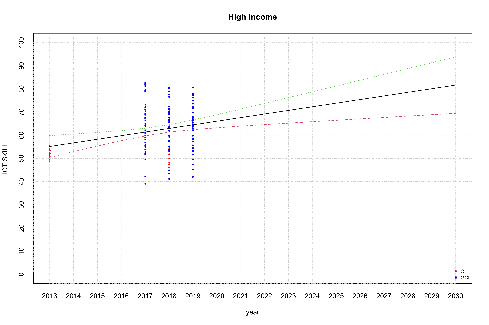
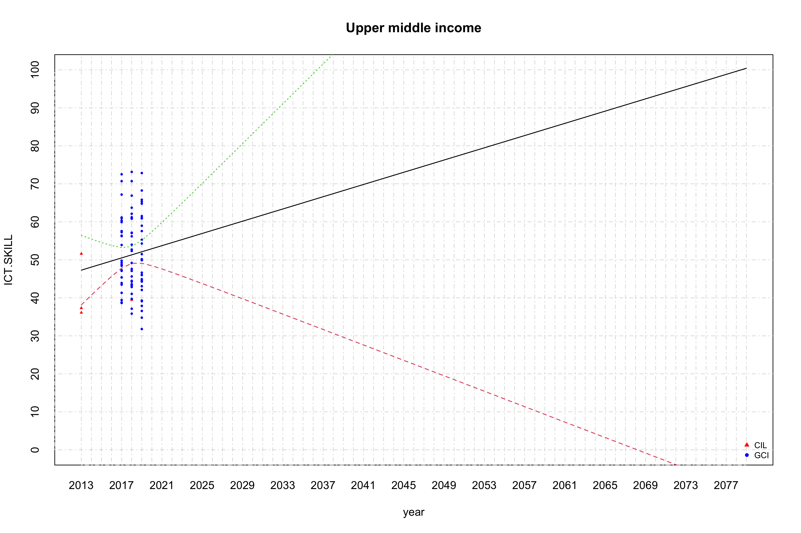
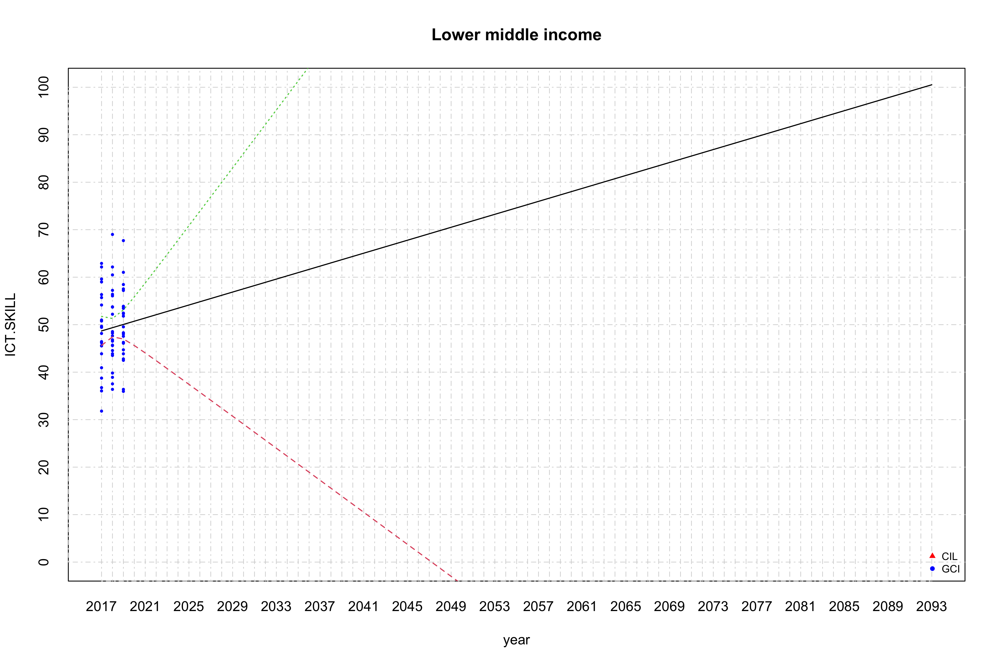
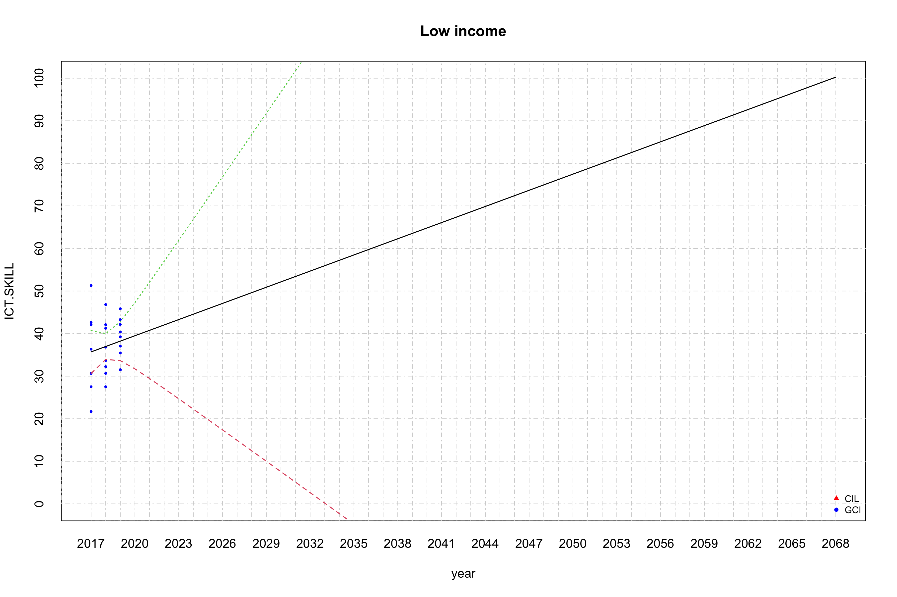
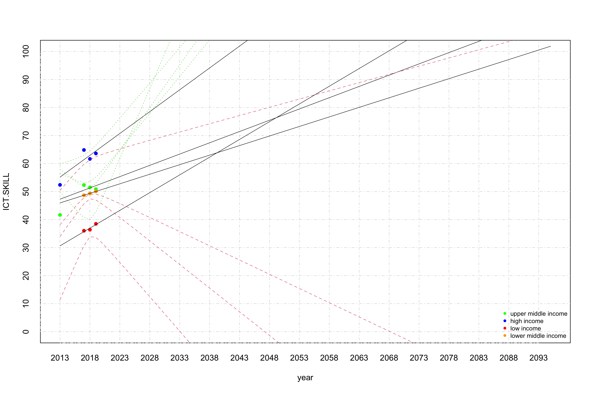
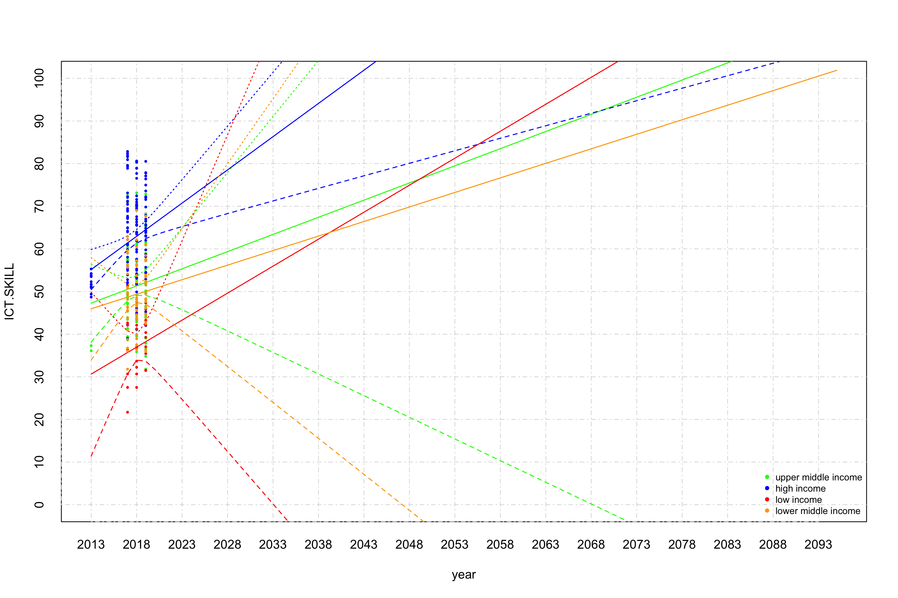

Linear regression for Information and Comunication Technology (ICT)
Skill
================
Geiser C. Challco <geiser@alumni.usp.br>

- <a href="#initial-variables-and-data"
  id="toc-initial-variables-and-data">Initial Variables and Data</a>
  - <a href="#getting-gci-40-digital-skills"
    id="toc-getting-gci-40-digital-skills">getting GCI 4.0 (Digital
    Skills)</a>
  - <a href="#getting-cil-icils" id="toc-getting-cil-icils">getting CIL
    (ICILS)</a>
- <a href="#calculating-data-with-mean-values"
  id="toc-calculating-data-with-mean-values">Calculating data with mean
  values</a>
- <a href="#linear-regression" id="toc-linear-regression">Linear
  Regression</a>
  - <a href="#linear-regression-for-high-income-countries"
    id="toc-linear-regression-for-high-income-countries">Linear regression
    for high income countries</a>
  - <a href="#linear-regression-for-upper-middle-income-countries"
    id="toc-linear-regression-for-upper-middle-income-countries">Linear
    regression for upper middle income countries</a>
  - <a href="#linear-regression-for-lower-middle-income-countries"
    id="toc-linear-regression-for-lower-middle-income-countries">Linear
    regression for lower middle income countries</a>
  - <a href="#linear-regression-for-low-income-countries"
    id="toc-linear-regression-for-low-income-countries">Linear regression
    for low income countries</a>
  - <a href="#summary-of-linear-regression-with-average-values"
    id="toc-summary-of-linear-regression-with-average-values">Summary of
    linear regression with average values</a>

## Initial Variables and Data

``` r
mtd.df <- read_excel("../data/ICT_and_Digital_Skill.xlsx", sheet = "metadata")
GCI.df <- read_excel("../data/ICT_and_Digital_Skill.xlsx", sheet = "Digital Skill value")
CIL.df <- read_excel("../data/ICT_and_Digital_Skill.xlsx", sheet = "ICILS (CIL)")
```

### getting GCI 4.0 (Digital Skills)

``` r
gci.idx <-which(mtd.df$`Indicator Id`=="41400")
gci.val <- 100*(GCI.df$`2017` - mtd.df$min[gci.idx])/(mtd.df$max[gci.idx] - mtd.df$min[gci.idx])

dat <- data.frame(country=GCI.df$`Country Name`,value=gci.val,year=2017,IncomeGroup=GCI.df$IncomeGroup, indicator="GCI")


gci.val <- 100*(GCI.df$`2018` - mtd.df$min[gci.idx])/(mtd.df$max[gci.idx] - mtd.df$min[gci.idx])

dat <- rbind(
  dat,
  data.frame(country=GCI.df$`Country Name`,value=gci.val,year=2018,IncomeGroup=GCI.df$IncomeGroup, indicator="GCI")
)

gci.val <- 100*(GCI.df$`2019` - mtd.df$min[gci.idx])/(mtd.df$max[gci.idx] - mtd.df$min[gci.idx])

dat <- rbind(
  dat,
  data.frame(country=GCI.df$`Country Name`,value=gci.val,year=2019,IncomeGroup=GCI.df$IncomeGroup, indicator="GCI")
)
```

### getting CIL (ICILS)

``` r
cli.idx <-which(mtd.df$`Indicator Id`=="CIL")
cli.val <- 100*(CIL.df$CIL - mtd.df$min[cli.idx])/(mtd.df$max[cli.idx] - mtd.df$min[cli.idx])

dat <- rbind(
  dat,
  data.frame(country=CIL.df$country,value=cli.val,year=CIL.df$year,IncomeGroup=CIL.df$IncomeGroup, indicator="CIL")
)

dat <- dat[!is.na(dat$IncomeGroup) & !is.na(dat$value),]


lmdls <- c()
smdls <- c()

income_grp <- unique(dat$IncomeGroup)
(income_grp <- income_grp[!is.na(income_grp)])
```

    ## [1] "Upper middle income" "High income"         "Low income"         
    ## [4] "Lower middle income"

## Calculating data with mean values

``` r
df <- get_data(dat, income_grp[1], is.mean = T)
for (i in 2:length(income_grp)) {
  grp = income_grp[i]
  df <- merge(df, get_data(dat, grp, is.mean = T), by="year", suffixes = c(income_grp[i-1], grp))
}
colnames(df) <- c("year",income_grp)

knitr::kable(df)
```

| year | Upper middle income | High income | Low income | Lower middle income |
|-----:|--------------------:|------------:|-----------:|--------------------:|
| 2017 |            52.34841 |    64.84856 |   36.03130 |            48.70300 |
| 2018 |            51.50400 |    61.65731 |   36.38322 |            49.32964 |
| 2019 |            50.85967 |    63.61129 |   38.48896 |            50.06723 |

## Linear Regression

### Linear regression for high income countries

``` r
grp = income_grp[2]
dat2 <- get_data(dat, grp, F, c("indicator"))

fit <- lm(ICT.SKILL ~ year, data=dat2)
smdls[[grp]] <- fit
summary(fit)
```

    ## 
    ## Call:
    ## lm(formula = ICT.SKILL ~ year, data = dat2)
    ## 
    ## Residuals:
    ##      Min       1Q   Median       3Q      Max 
    ## -22.4815  -6.6657  -0.3901   7.1731  21.4553 
    ## 
    ## Coefficients:
    ##               Estimate Std. Error t value Pr(>|t|)   
    ## (Intercept) -3082.2695   993.3054  -3.103  0.00227 **
    ## year            1.5586     0.4923   3.166  0.00186 **
    ## ---
    ## Signif. codes:  0 '***' 0.001 '**' 0.01 '*' 0.05 '.' 0.1 ' ' 1
    ## 
    ## Residual standard error: 9.982 on 158 degrees of freedom
    ## Multiple R-squared:  0.05965,    Adjusted R-squared:  0.0537 
    ## F-statistic: 10.02 on 1 and 158 DF,  p-value: 0.001856

``` r
pyear <- seq(min(dat2$year), 2030, 1)

inds <- list("CIL"=c(17,"red"), "GCI"=c(16,"blue"))
plot(c(), c(), xlim = c(min(pyear), max(pyear)), ylim = c(0,100),
     main = grp, xaxt='n',yaxt='n', xlab = "year", ylab = "ICT.SKILL")
axis(1, at = seq(min(pyear), max(pyear), 1), tck = 1, lty = 4, col = "lightgray", lwd = 0.75)
axis(2, at = seq(0, 100, 10), tck = 1, lty = 4, col = "lightgray", lwd = 0.75)
for (ind in names(inds)) {
  points(dat2$year[which(dat2$indicator==ind)], dat2$ICT.SKILL[which(dat2$indicator==ind)],
         pch=as.integer(inds[[ind]][1]), col=inds[[ind]][2], cex=0.5)
}
matlines(pyear, predict(fit, newdata=list(year=pyear), interval="confidence"), lwd=1.25)
legend("bottomright", legend=names(inds), col=c("red","blue","purple"), lty=0,  cex = 0.75, bg = "transparent", pch=c(17,16,18), box.lty=0)
```

<!-- -->

### Linear regression for upper middle income countries

``` r
grp = income_grp[1]
dat2 <- get_data(dat, grp, F, c("indicator"))

fit <- lm(ICT.SKILL ~ year, data=dat2)
smdls[[grp]] <- fit
summary(fit)
```

    ## 
    ## Call:
    ## lm(formula = ICT.SKILL ~ year, data = dat2)
    ## 
    ## Residuals:
    ##     Min      1Q  Median      3Q     Max 
    ## -20.338  -7.839  -1.962   8.829  22.009 
    ## 
    ## Coefficients:
    ##               Estimate Std. Error t value Pr(>|t|)
    ## (Intercept) -1572.9009  1849.1758  -0.851    0.397
    ## year            0.8049     0.9164   0.878    0.382
    ## 
    ## Residual standard error: 10.38 on 85 degrees of freedom
    ## Multiple R-squared:  0.008993,   Adjusted R-squared:  -0.002665 
    ## F-statistic: 0.7714 on 1 and 85 DF,  p-value: 0.3823

``` r
predict(fit, newdata=list(year=c(2079)))
```

    ##      1 
    ## 100.41

``` r
pyear <- seq(min(dat2$year), 2079, 1)

inds <- list("CIL"=c(17,"red"), "GCI"=c(16,"blue"))
plot(c(), c(), xlim = c(min(pyear), max(pyear)), ylim = c(0,100),
     main = grp, xaxt='n',yaxt='n', xlab = "year", ylab = "ICT.SKILL")
axis(1, at = seq(min(pyear), max(pyear), 1), tck = 1, lty = 4, col = "lightgray", lwd = 0.75)
axis(2, at = seq(0, 100, 10), tck = 1, lty = 4, col = "lightgray", lwd = 0.75)
for (ind in names(inds)) {
  points(dat2$year[which(dat2$indicator==ind)], dat2$ICT.SKILL[which(dat2$indicator==ind)],
         pch=as.integer(inds[[ind]][1]), col=inds[[ind]][2], cex=0.5)
}
matlines(pyear, predict(fit, newdata=list(year=pyear), interval="confidence"), lwd=1.25)
legend("bottomright", legend=names(inds), col=c("red","blue","purple"), lty=0,  cex = 0.75, bg = "transparent", pch=c(17,16,18), box.lty=0)
```

<!-- -->

### Linear regression for lower middle income countries

``` r
grp = income_grp[4]
dat2 <- get_data(dat, grp, F, c("indicator"))

fit <- lm(ICT.SKILL ~ year, data=dat2)
smdls[[grp]] <- fit
summary(fit)
```

    ## 
    ## Call:
    ## lm(formula = ICT.SKILL ~ year, data = dat2)
    ## 
    ## Residuals:
    ##      Min       1Q   Median       3Q      Max 
    ## -16.8863  -4.8157  -0.8288   5.4601  19.6357 
    ## 
    ## Coefficients:
    ##               Estimate Std. Error t value Pr(>|t|)
    ## (Intercept) -1327.1436  2396.9420  -0.554    0.582
    ## year            0.6821     1.1878   0.574    0.568
    ## 
    ## Residual standard error: 8.056 on 67 degrees of freedom
    ## Multiple R-squared:  0.004898,   Adjusted R-squared:  -0.009954 
    ## F-statistic: 0.3298 on 1 and 67 DF,  p-value: 0.5677

``` r
predict(fit, newdata=list(year=c(2093)))
```

    ##        1 
    ## 100.5253

``` r
pyear <- seq(min(dat2$year), 2093, 1)

inds <- list("CIL"=c(17,"red"), "GCI"=c(16,"blue"))
plot(c(), c(), xlim = c(min(pyear), max(pyear)), ylim = c(0,100),
     main = grp, xaxt='n',yaxt='n', xlab = "year", ylab = "ICT.SKILL")
axis(1, at = seq(min(pyear), max(pyear), 1), tck = 1, lty = 4, col = "lightgray", lwd = 0.75)
axis(2, at = seq(0, 100, 10), tck = 1, lty = 4, col = "lightgray", lwd = 0.75)
for (ind in names(inds)) {
  points(dat2$year[which(dat2$indicator==ind)], dat2$ICT.SKILL[which(dat2$indicator==ind)],
         pch=as.integer(inds[[ind]][1]), col=inds[[ind]][2], cex=0.5)
}
matlines(pyear, predict(fit, newdata=list(year=pyear), interval="confidence"), lwd=1.25)
legend("bottomright", legend=names(inds), col=c("red","blue","purple"), lty=0,  cex = 0.75, bg = "transparent", pch=c(17,16,18), box.lty=0)
```

<!-- -->

### Linear regression for low income countries

``` r
grp = income_grp[3]
dat2 <- get_data(dat, grp, F, c("indicator"))

fit <- lm(ICT.SKILL ~ year, data=dat2)
smdls[[grp]] <- fit
summary(fit)
```

    ## 
    ## Call:
    ## lm(formula = ICT.SKILL ~ year, data = dat2)
    ## 
    ## Residuals:
    ##      Min       1Q   Median       3Q      Max 
    ## -14.0059  -5.3570   0.2474   5.0765  15.5831 
    ## 
    ## Coefficients:
    ##              Estimate Std. Error t value Pr(>|t|)
    ## (Intercept) -2517.326   3633.304  -0.693    0.496
    ## year            1.266      1.800   0.703    0.489
    ## 
    ## Residual standard error: 7.164 on 22 degrees of freedom
    ## Multiple R-squared:  0.02197,    Adjusted R-squared:  -0.02248 
    ## F-statistic: 0.4943 on 1 and 22 DF,  p-value: 0.4894

``` r
predict(fit, newdata=list(year=c(2068)))
```

    ##        1 
    ## 100.2524

``` r
pyear <- seq(min(dat2$year), 2068, 1)

inds <- list("CIL"=c(17,"red"), "GCI"=c(16,"blue"))
plot(c(), c(), xlim = c(min(pyear), max(pyear)), ylim = c(0,100),
     main = grp, xaxt='n',yaxt='n', xlab = "year", ylab = "ICT.SKILL")
axis(1, at = seq(min(pyear), max(pyear), 1), tck = 1, lty = 4, col = "lightgray", lwd = 0.75)
axis(2, at = seq(0, 100, 10), tck = 1, lty = 4, col = "lightgray", lwd = 0.75)
for (ind in names(inds)) {
  points(dat2$year[which(dat2$indicator==ind)], dat2$ICT.SKILL[which(dat2$indicator==ind)],
         pch=as.integer(inds[[ind]][1]), col=inds[[ind]][2], cex=0.5)
}
matlines(pyear, predict(fit, newdata=list(year=pyear), interval="confidence"), lwd=1.25)
legend("bottomright", legend=names(inds), col=c("red","blue","purple"), lty=0,  cex = 0.75, bg = "transparent", pch=c(17,16,18), box.lty=0)
```

<!-- -->

### Summary of linear regression with average values

``` r
pyear <- seq(min(dat$year), 2095, 1)
plot(x=pyear, y=c(), xlim = c(min(pyear), max(pyear)), ylim=c(0,100), ylab = "ICT.SKILL", xlab = "year", xaxt='n',yaxt='n')
axis(1, at = seq(min(pyear),max(pyear), 5), tck = 1, lty = 4, col = "lightgray", lwd = 0.75)
axis(2, at = seq(0, 100, 10), tck = 1, lty = 4, col = "lightgray", lwd = 0.75)


colors <- c("green","blue","red","orange")
names(colors) <- income_grp
for (grp in income_grp) {
  gdat <- get_data(dat, grp, is.mean = T)
  points(x=gdat$year, y=gdat$ICT.SKILL, pch=16, col=colors[grp], xaxt='n', yaxt='n', cex=1)
  matlines(pyear, predict(smdls[[grp]], newdata=list(year=pyear), interval="confidence"), lwd=0.75)
}
legend("bottomright", legend=c("upper middle income","high income","low income","lower middle income"),
       col=colors, lty=0,  cex = 0.75, bg = "transparent", pch=16, box.lty=0)
```

<!-- -->

``` r
pyear <- seq(min(dat$year), 2095, 1)
plot(x=pyear, y=c(), xlim = c(min(pyear), max(pyear)), ylim=c(0,100), ylab = "ICT.SKILL", xlab = "year", xaxt='n',yaxt='n')
axis(1, at = seq(min(pyear),max(pyear), 5), tck = 1, lty = 4, col = "lightgray", lwd = 0.75)
axis(2, at = seq(0, 100, 10), tck = 1, lty = 4, col = "lightgray", lwd = 0.75)

colors <- c("green","blue","red","orange")
names(colors) <- income_grp
for (grp in income_grp) {
  gdat <- get_data(dat, grp, is.mean = F)
  points(x=gdat$year, y=gdat$ICT.SKILL, pch=16, col=as.character(colors[grp]), xaxt='n', yaxt='n', cex=0.5)
  matlines(pyear, col = colors[grp], predict(smdls[[grp]], newdata=list(year=pyear), interval="confidence"), lwd=1.25)
}
legend("bottomright", legend=c("upper middle income","high income","low income","lower middle income"),
       col=colors, lty=0,  cex = 0.75, bg = "transparent", pch=16, box.lty=0)
```

<!-- -->
