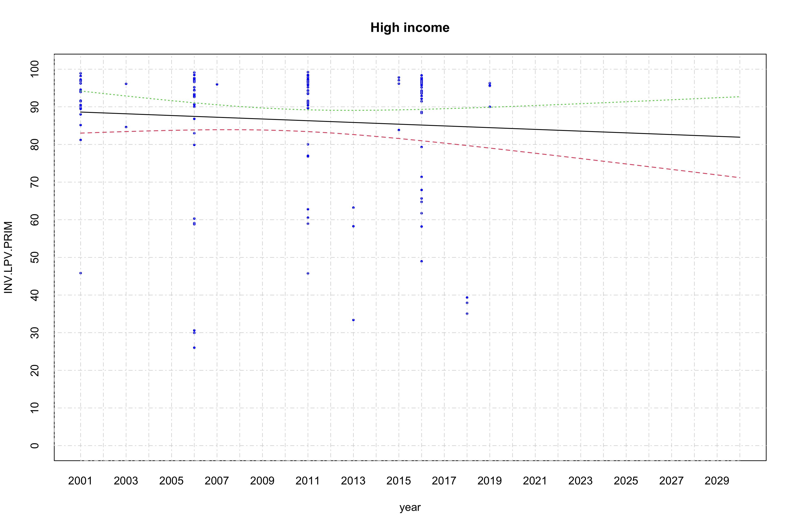
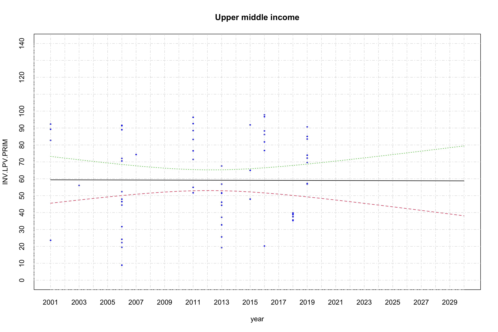
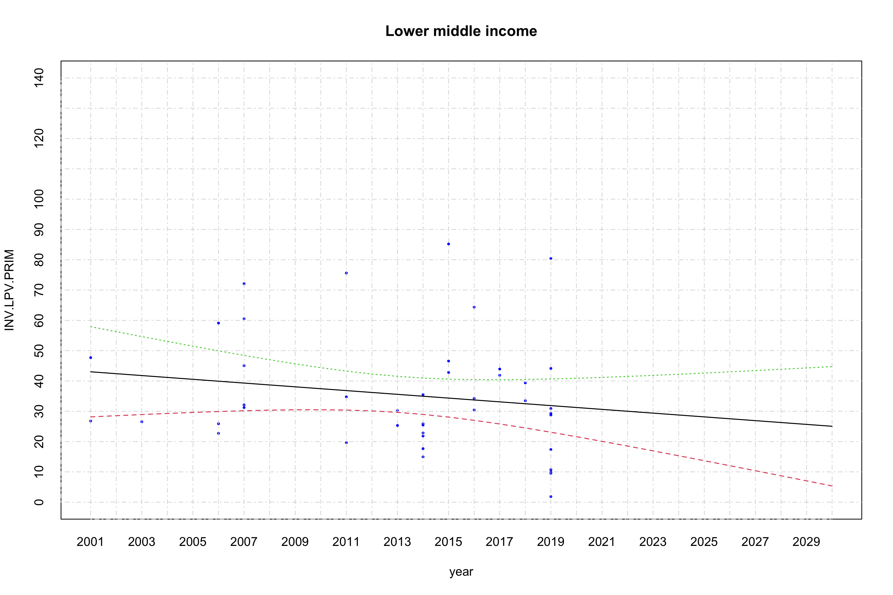
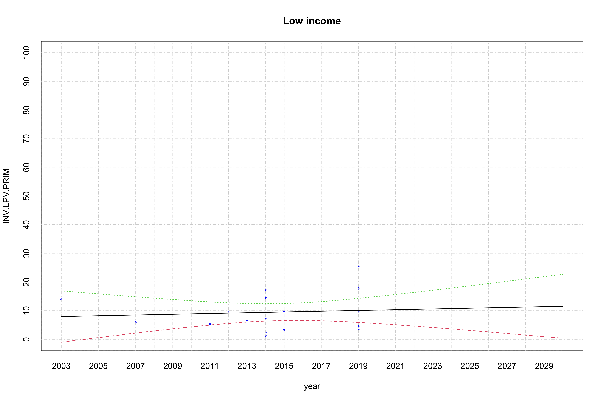
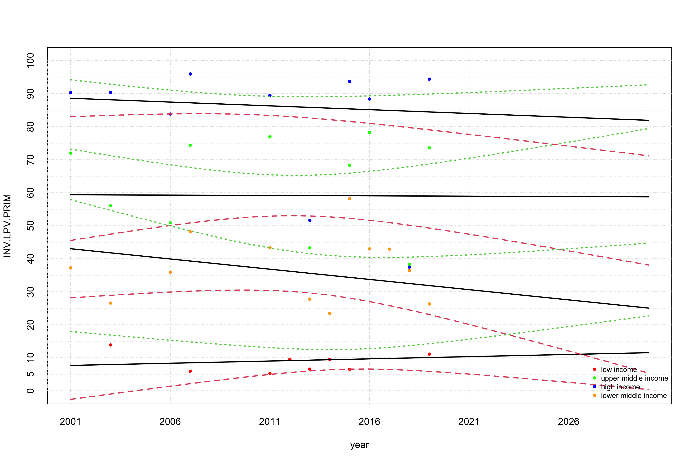
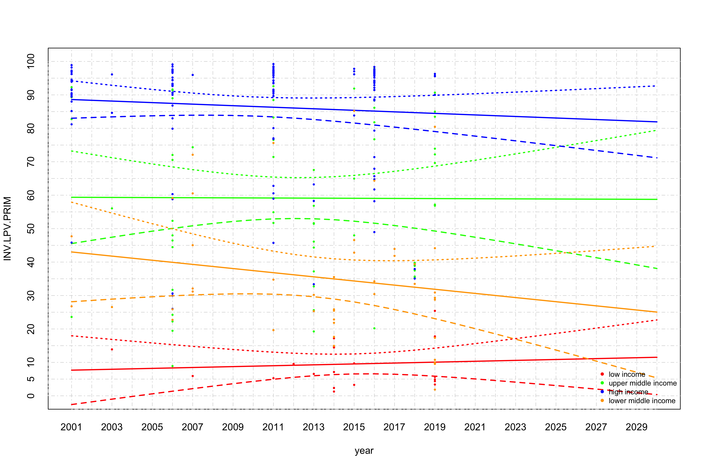

Linear and logist regression analysis to inverse learning poverty
================
Geiser C. Challco <geiser@alumni.usp.br>

- <a href="#initial-variables-and-data"
  id="toc-initial-variables-and-data">Initial Variables and Data</a>
- <a href="#calculating-data-with-mean-values"
  id="toc-calculating-data-with-mean-values">Calculating data with mean
  values</a>
- <a href="#linear-regression" id="toc-linear-regression">Linear
  Regression</a>
  - <a href="#linear-regression-for-high-income-countries"
    id="toc-linear-regression-for-high-income-countries">Linear regression
    for high income countries</a>
  - <a href="#linear-regression-for-upper-middle-income-countries"
    id="toc-linear-regression-for-upper-middle-income-countries">Linear
    regression for upper middle income countries</a>
  - <a href="#linear-regression-for-lower-middle-income-countries"
    id="toc-linear-regression-for-lower-middle-income-countries">Linear
    regression for lower middle income countries</a>
  - <a href="#linear-regression-for-low-income-countries"
    id="toc-linear-regression-for-low-income-countries">Linear regression
    for low income countries</a>
  - <a href="#summary-of-logistic-regression-with-average-values"
    id="toc-summary-of-logistic-regression-with-average-values">Summary of
    logistic regression with average values</a>

## Initial Variables and Data

``` r
dat <- read_excel("../data/lpv_edstats_update2021.xlsx", sheet = "LPV")
dat[["inv.value"]] <- 100-dat$value

lmdls <- c()
smdls <- c()

income_grp <- unique(dat$IncomeGroup)
(income_grp <- income_grp[!is.na(income_grp)])
```

    ## [1] "Low income"          "Upper middle income" "High income"        
    ## [4] "Lower middle income"

## Calculating data with mean values

``` r
df <- get_data(dat, income_grp[1], is.mean = T)

dat[dat$IncomeGroup == income_grp[1], c("year","inv.value")]
```

    ## # A tibble: 43 × 2
    ##     year inv.value
    ##    <dbl>     <dbl>
    ##  1  2013      6.55
    ##  2  2014      7.13
    ##  3  2019      4.38
    ##  4  2014     14.6 
    ##  5  2019     25.4 
    ##  6  2019      3.39
    ##  7    NA     NA   
    ##  8    NA     NA   
    ##  9    NA     NA   
    ## 10    NA     NA   
    ## # … with 33 more rows

``` r
for (i in 2:length(income_grp)) {
  grp = income_grp[i]
  df <- merge(df, get_data(dat, grp, is.mean = T), by="year", suffixes = c(income_grp[i-1], grp))
}
colnames(df) <- c("year",income_grp)

knitr::kable(df)
```

| year | Low income | Upper middle income | High income | Lower middle income |
|-----:|-----------:|--------------------:|------------:|--------------------:|
| 2001 |        NaN |            71.97894 |    90.31669 |            37.23317 |
| 2003 |  13.890793 |            56.05913 |    90.37062 |            26.54340 |
| 2006 |        NaN |            50.88008 |    83.82297 |            35.90777 |
| 2007 |   5.927780 |            74.33962 |    95.96599 |            48.19271 |
| 2011 |   5.268471 |            76.90376 |    89.49669 |            43.33655 |
| 2012 |   9.549141 |                 NaN |         NaN |                 NaN |
| 2013 |   6.552002 |            43.27333 |    51.62419 |            27.75911 |
| 2014 |   9.505999 |                 NaN |         NaN |            23.44302 |
| 2015 |   6.491322 |            68.28061 |    93.71170 |            58.20342 |
| 2016 |        NaN |            78.24192 |    88.37233 |            43.00317 |
| 2017 |        NaN |                 NaN |         NaN |            42.89755 |
| 2018 |        NaN |            38.29312 |    37.44307 |            36.42434 |
| 2019 |  11.083475 |            73.61854 |    94.38630 |            26.30300 |

## Linear Regression

### Linear regression for high income countries

``` r
grp = income_grp[3]
dat2 <- get_data(dat, grp)

fit <- lm(INV.LPV.PRIM ~ year, data=dat2)

smdls[[grp]] <- fit
summary(fit)
```

    ## 
    ## Call:
    ## lm(formula = INV.LPV.PRIM ~ year, data = dat2)
    ## 
    ## Residuals:
    ##     Min      1Q  Median      3Q     Max 
    ## -61.449  -0.251   7.195  10.324  13.203 
    ## 
    ## Coefficients:
    ##             Estimate Std. Error t value Pr(>|t|)
    ## (Intercept) 549.4142   532.1395   1.032    0.304
    ## year         -0.2303     0.2647  -0.870    0.386
    ## 
    ## Residual standard error: 17.22 on 140 degrees of freedom
    ## Multiple R-squared:  0.005376,   Adjusted R-squared:  -0.001728 
    ## F-statistic: 0.7568 on 1 and 140 DF,  p-value: 0.3858

``` r
pyear <- seq(min(dat2$year), 2030, 1)
plot(dat2, xlim = c(min(pyear), max(pyear)), ylim = c(0,100),
     pch=16, col="blue", main = grp, xaxt='n',yaxt='n', cex = 0.5)
axis(1, at = seq(min(pyear), max(pyear), 1), tck = 1, lty = 4, col = "lightgray", lwd = 0.75)
axis(2, at = seq(0, 140, 10), tck = 1, lty = 4, col = "lightgray", lwd = 0.75)

matlines(pyear, predict(fit, newdata=list(year=pyear), interval="confidence"), lwd=1.25)
```

<!-- -->

### Linear regression for upper middle income countries

``` r
grp = income_grp[2]
dat2 <- get_data(dat, grp)

fit <- lm(INV.LPV.PRIM ~ year, data=dat2)
smdls[[grp]] <- fit
summary(fit)
```

    ## 
    ## Call:
    ## lm(formula = INV.LPV.PRIM ~ year, data = dat2)
    ## 
    ## Residuals:
    ##     Min      1Q  Median      3Q     Max 
    ## -50.364 -19.751  -2.778  23.906  38.764 
    ## 
    ## Coefficients:
    ##               Estimate Std. Error t value Pr(>|t|)
    ## (Intercept)  102.36726 1117.24578   0.092    0.927
    ## year          -0.02148    0.55523  -0.039    0.969
    ## 
    ## Residual standard error: 24.83 on 64 degrees of freedom
    ## Multiple R-squared:  2.339e-05,  Adjusted R-squared:  -0.0156 
    ## F-statistic: 0.001497 on 1 and 64 DF,  p-value: 0.9693

``` r
pyear <- seq(min(dat2$year), 2030, 1)
plot(dat2, xlim = c(min(pyear), max(pyear)), ylim = c(0,140),
     pch=16, col="blue", main = grp, xaxt='n',yaxt='n', cex = 0.5)
axis(1, at = seq(min(pyear), max(pyear), 1), tck = 1, lty = 4, col = "lightgray", lwd = 0.75)
axis(2, at = seq(0, 140, 10), tck = 1, lty = 4, col = "lightgray", lwd = 0.75)

matlines(pyear, predict(fit, newdata=list(year=pyear), interval="confidence"), lwd=1.25)
```

<!-- -->

### Linear regression for lower middle income countries

``` r
grp = income_grp[4]
dat2 <- get_data(dat, grp)

fit <- lm(INV.LPV.PRIM ~ year, data=dat2)
smdls[[grp]] <- fit
summary(fit)
```

    ## 
    ## Call:
    ## lm(formula = INV.LPV.PRIM ~ year, data = dat2)
    ## 
    ## Residuals:
    ##     Min      1Q  Median      3Q     Max 
    ## -30.000 -14.272  -3.116   8.615  50.864 
    ## 
    ## Coefficients:
    ##              Estimate Std. Error t value Pr(>|t|)
    ## (Intercept) 1283.5027  1114.7723   1.151    0.256
    ## year          -0.6199     0.5537  -1.120    0.269
    ## 
    ## Residual standard error: 19.29 on 41 degrees of freedom
    ## Multiple R-squared:  0.02966,    Adjusted R-squared:  0.005997 
    ## F-statistic: 1.253 on 1 and 41 DF,  p-value: 0.2694

``` r
pyear <- seq(min(dat2$year), 2030, 1)
plot(dat2, xlim = c(min(pyear), max(pyear)), ylim = c(0,140),
     pch=16, col="blue", main = grp, xaxt='n',yaxt='n', cex = 0.5)
axis(1, at = seq(min(pyear), max(pyear), 1), tck = 1, lty = 4, col = "lightgray", lwd = 0.75)
axis(2, at = seq(0, 140, 10), tck = 1, lty = 4, col = "lightgray", lwd = 0.75)

matlines(pyear, predict(fit, newdata=list(year=pyear), interval="confidence"), lwd=1.25)
```

<!-- -->

### Linear regression for low income countries

``` r
grp = income_grp[1]
dat2 <- get_data(dat, grp)

fit <- lm(INV.LPV.PRIM ~ year, data=dat2)
smdls[[grp]] <- fit
summary(fit)
```

    ## 
    ## Call:
    ## lm(formula = INV.LPV.PRIM ~ year, data = dat2)
    ## 
    ## Residuals:
    ##    Min     1Q Median     3Q    Max 
    ## -8.125 -5.149 -2.274  5.229 15.343 
    ## 
    ## Coefficients:
    ##              Estimate Std. Error t value Pr(>|t|)
    ## (Intercept) -258.2715   683.5557  -0.378     0.71
    ## year           0.1329     0.3393   0.392     0.70
    ## 
    ## Residual standard error: 6.531 on 19 degrees of freedom
    ## Multiple R-squared:  0.008013,   Adjusted R-squared:  -0.0442 
    ## F-statistic: 0.1535 on 1 and 19 DF,  p-value: 0.6996

``` r
pyear <- seq(min(dat2$year), 2030, 1)
plot(dat2, xlim = c(min(pyear), max(pyear)), ylim = c(0,100),
     pch=16, col="blue", main = grp, xaxt='n',yaxt='n', cex = 0.5)
axis(1, at = seq(min(pyear), max(pyear), 1), tck = 1, lty = 4, col = "lightgray", lwd = 0.75)
axis(2, at = seq(0, 100, 10), tck = 1, lty = 4, col = "lightgray", lwd = 0.75)

matlines(pyear, predict(fit, newdata=list(year=pyear), interval="confidence"), lwd=1.25)
```

<!-- -->

### Summary of logistic regression with average values

``` r
pyear <- seq(min(dat$year), 2030, 1)
plot(x=pyear, y=c(), xlim = c(min(pyear), max(pyear)), ylim=c(0,100),
     ylab = "INV.LPV.PRIM", xlab = "year", xaxt='n',yaxt='n')
axis(1, at = seq(min(pyear),max(pyear), 5), tck = 1, lty = 4, col = "lightgray", lwd = 0.75)
axis(2, at = seq(0, 100, 5), tck = 1, lty = 4, col = "lightgray", lwd = 0.75)


colors <- c("red","green","blue","orange")
names(colors) <- income_grp
for (grp in income_grp) {
  gdat <- get_data(dat, grp, is.mean = T)
  points(x=gdat$year, y=gdat$INV.LPV.PRIM, pch=16, col=colors[grp], xaxt='n', yaxt='n', cex=0.75)
  matlines(pyear, predict(smdls[[grp]], newdata=list(year=pyear), interval="confidence"), lwd=2)
}
legend("bottomright", legend=c("low income","upper middle income","high income","lower middle income"),
       col=colors, lty=0,  cex = 0.75, bg = "transparent", pch=16, box.lty=0)
```

<!-- -->

``` r
pyear <- seq(min(dat$year), 2030, 1)
plot(x=pyear, y=c(), xlim = c(min(pyear), max(pyear)), ylim=c(0,100),
     ylab = "INV.LPV.PRIM", xlab = "year", xaxt='n',yaxt='n')
axis(1, at = seq(min(pyear),max(pyear), 1), tck = 1, lty = 4, col = "lightgray", lwd = 0.75)
axis(2, at = seq(0, 100, 5), tck = 1, lty = 4, col = "lightgray", lwd = 0.75)

colors <- c("red","green","blue","orange")
names(colors) <- income_grp
for (grp in income_grp) {
  gdat <- get_data(dat, grp, is.mean = F)
  points(x=gdat$year, y=gdat$INV.LPV.PRIM, pch=16, col=as.character(colors[grp]), xaxt='n', yaxt='n', cex=0.5)
  matlines(pyear, col = colors[grp], predict(smdls[[grp]], newdata=list(year=pyear), interval="confidence"), lwd=2)
}
legend("bottomright", legend=c("low income","upper middle income","high income","lower middle income"),
       col=colors, lty=0,  cex = 0.75, bg = "transparent", pch=16, box.lty=0)
```

<!-- -->
