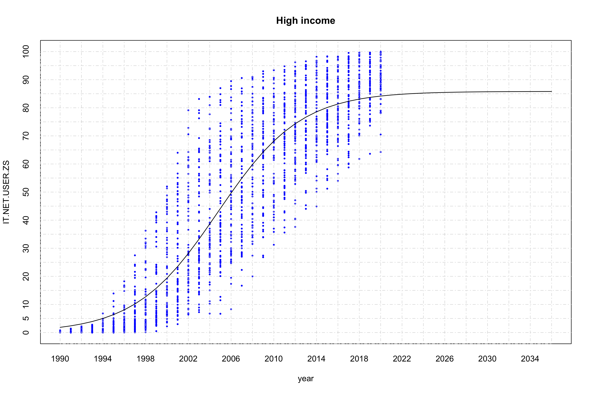
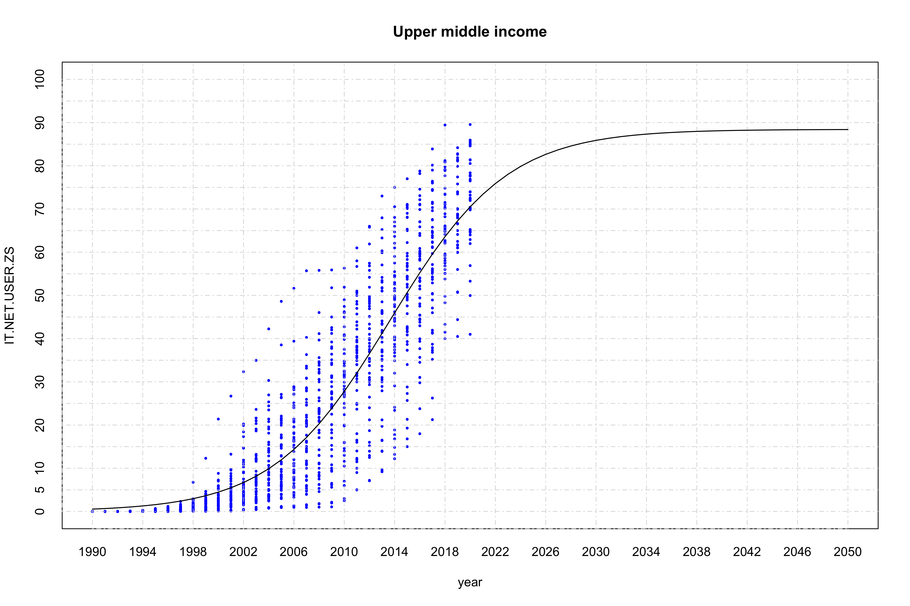
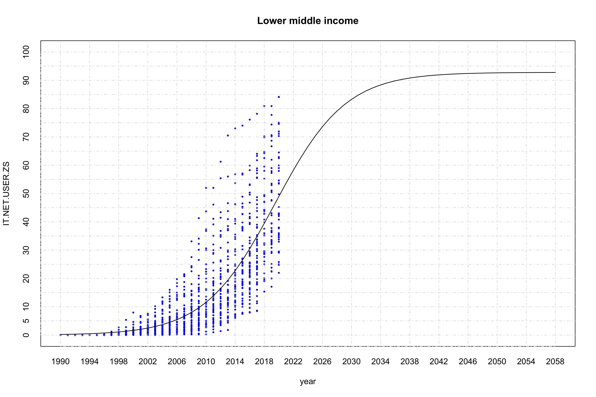
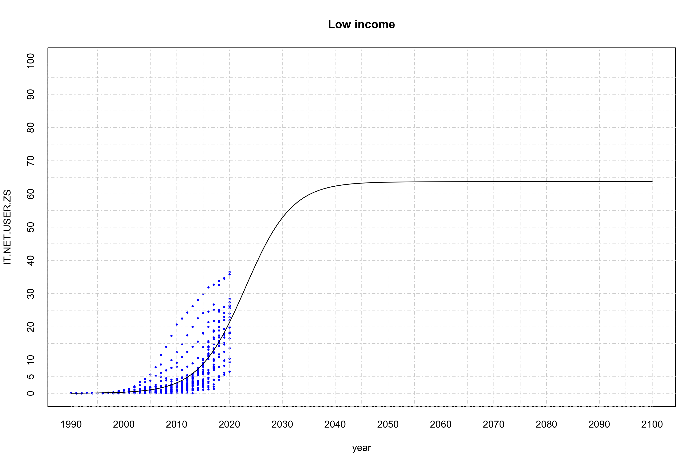
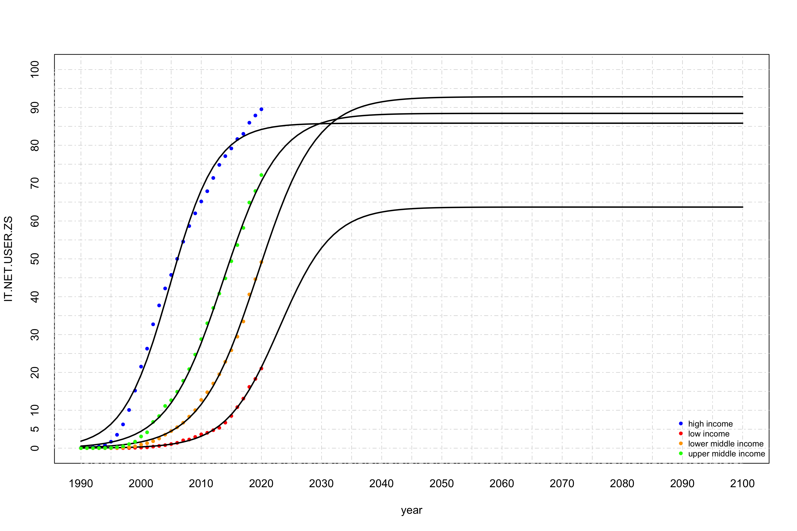
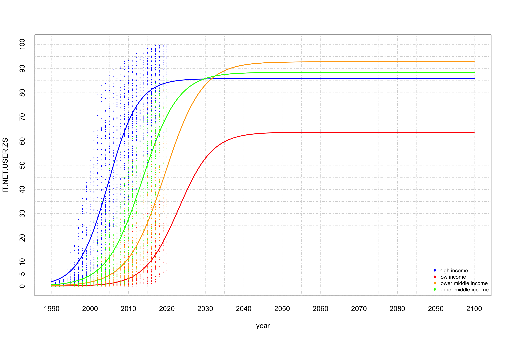

Logist regression analysis of internet access
================
Geiser C. Challco <geiser@alumni.usp.br>

- <a href="#initial-variables-and-data"
  id="toc-initial-variables-and-data">Initial Variables and Data</a>
- <a href="#calculating-data-with-mean-values"
  id="toc-calculating-data-with-mean-values">Calculating data with mean
  values</a>
- <a href="#logistic-regression" id="toc-logistic-regression">Logistic
  Regression</a>
  - <a href="#logistic-regression-for-high-income-countries"
    id="toc-logistic-regression-for-high-income-countries">Logistic
    regression for high income countries</a>
  - <a href="#logistic-regression-for-upper-middle-income-countries"
    id="toc-logistic-regression-for-upper-middle-income-countries">Logistic
    regression for upper middle income countries</a>
  - <a href="#logistic-regression-for-lower-middle-income-countries"
    id="toc-logistic-regression-for-lower-middle-income-countries">Logistic
    regression for lower middle income countries</a>
  - <a href="#logistic-regression-for-low-income-countries"
    id="toc-logistic-regression-for-low-income-countries">Logistic
    regression for low income countries</a>
  - <a href="#summary-of-logistic-regression-with-average-values"
    id="toc-summary-of-logistic-regression-with-average-values">Summary of
    logistic regression with average values</a>

## Initial Variables and Data

``` r
dat <- read_excel("../data/API_IT.NET.USER.ZS_DS2_en_excel_v2_4578034.xlsx", sheet = "Data")

lmdls <- c()
smdls <- c()

income_grp <- unique(dat$IncomeGroup)
(income_grp <- income_grp[!is.na(income_grp)])
```

    ## [1] "High income"         "Low income"          "Lower middle income"
    ## [4] "Upper middle income"

## Calculating data with mean values

``` r
df <- get_data(dat, income_grp[1], is.mean = T)
for (i in 2:length(income_grp)) {
  grp = income_grp[i]
  df <- merge(df, get_data(dat, grp, is.mean = T), by="year", suffixes = c(income_grp[i-1], grp))
}
colnames(df) <- c("year",income_grp)

knitr::kable(df)
```

| year | High income | Low income | Lower middle income | Upper middle income |
|-----:|------------:|-----------:|--------------------:|--------------------:|
| 1990 |   0.0671058 |  0.0000000 |           0.0000000 |           0.0000000 |
| 1991 |   0.1454583 |  0.0000000 |           0.0000000 |           0.0004413 |
| 1992 |   0.2647899 |  0.0000000 |           0.0000021 |           0.0015767 |
| 1993 |   0.3964793 |  0.0000000 |           0.0000365 |           0.0071608 |
| 1994 |   0.7911073 |  0.0002561 |           0.0009966 |           0.0219952 |
| 1995 |   1.6969305 |  0.0007982 |           0.0083312 |           0.0757508 |
| 1996 |   3.5315378 |  0.0041361 |           0.0465711 |           0.2512393 |
| 1997 |   6.2714005 |  0.0178438 |           0.1247625 |           0.4874393 |
| 1998 |  10.0863247 |  0.0385727 |           0.2571704 |           1.0589047 |
| 1999 |  15.1978418 |  0.1023982 |           0.4800223 |           1.7148949 |
| 2000 |  21.5348706 |  0.1509140 |           0.9489474 |           3.0918935 |
| 2001 |  26.2811537 |  0.2117980 |           1.3065904 |           4.1840204 |
| 2002 |  32.7128557 |  0.4048750 |           1.8292236 |           6.9248279 |
| 2003 |  37.7003655 |  0.5902493 |           2.5461456 |           8.4695207 |
| 2004 |  42.1865811 |  0.7932204 |           3.5553573 |          11.1434792 |
| 2005 |  45.7616444 |  1.0727464 |           4.5013860 |          12.6559611 |
| 2006 |  49.9984613 |  1.4028515 |           5.5375448 |          14.8918699 |
| 2007 |  54.5409368 |  2.0596837 |           6.7201414 |          17.7988164 |
| 2008 |  58.6774715 |  2.2787529 |           8.3296951 |          20.8653411 |
| 2009 |  62.0247681 |  2.9582266 |          10.0326415 |          24.7143137 |
| 2010 |  65.1609268 |  3.6408000 |          12.7364151 |          28.7954902 |
| 2011 |  67.8698835 |  4.0514346 |          14.7653823 |          32.9868507 |
| 2012 |  71.3689699 |  4.7450198 |          17.0758696 |          37.0258657 |
| 2013 |  74.8227091 |  5.3764525 |          19.5108191 |          40.8245658 |
| 2014 |  77.1314301 |  6.7417683 |          22.8145250 |          44.8462558 |
| 2015 |  79.1694788 |  8.5064896 |          25.8491503 |          49.3817013 |
| 2016 |  81.6434925 | 10.8334244 |          29.4463373 |          53.6443145 |
| 2017 |  83.0251791 | 13.0858931 |          33.4585235 |          58.1722156 |
| 2018 |  85.9626277 | 16.1782617 |          40.6027584 |          64.8826994 |
| 2019 |  87.8712168 | 18.2840909 |          44.6250172 |          67.9207244 |
| 2020 |  89.5181492 | 21.0466667 |          49.1476509 |          72.1393955 |
| 2021 |         NaN |        NaN |                 NaN |                 NaN |

## Logistic Regression

### Logistic regression for high income countries

``` r
grp = income_grp[1]
dat2 <- get_data(dat, grp)

fit <- nls(IT.NET.USER.ZS ~ SSlogis(year, Asym, xmid, scal), data=dat2)
smdls[[grp]] <- fit
summary(fit)
```

    ## 
    ## Formula: IT.NET.USER.ZS ~ SSlogis(year, Asym, xmid, scal)
    ## 
    ## Parameters:
    ##       Estimate Std. Error  t value Pr(>|t|)    
    ## Asym   85.8351     0.9320    92.10   <2e-16 ***
    ## xmid 2004.7754     0.1508 13291.23   <2e-16 ***
    ## scal    3.8719     0.1144    33.84   <2e-16 ***
    ## ---
    ## Signif. codes:  0 '***' 0.001 '**' 0.01 '*' 0.05 '.' 0.1 ' ' 1
    ## 
    ## Residual standard error: 13.44 on 2142 degrees of freedom
    ## 
    ## Number of iterations to convergence: 4 
    ## Achieved convergence tolerance: 8.016e-06

``` r
R2nls(fit)
```

    ## $PseudoR2
    ## [1] 0.8470138
    ## 
    ## $R2
    ## [1] 0.8012239

``` r
pyear <- seq(min(dat2$year), 2036, 1)
plot(dat2, xlim = c(min(pyear), max(pyear)), ylim = c(0,100),
     pch=16, col="blue", main = grp, xaxt='n',yaxt='n', cex = 0.5)
axis(1, at = seq(min(pyear), max(pyear), 2), tck = 1, lty = 4, col = "lightgray", lwd = 0.75)
axis(2, at = seq(0, 100, 5), tck = 1, lty = 4, col = "lightgray", lwd = 0.75)

matlines(pyear, predict(fit, newdata=list(year=pyear), interval="confidence"), lwd=1.25)
```

<!-- -->

### Logistic regression for upper middle income countries

``` r
grp = income_grp[4]
dat2 <- get_data(dat, grp)

fit <- nls(IT.NET.USER.ZS ~ SSlogis(year, Asym, xmid, scal), data=dat2)
smdls[[grp]] <- fit
summary(fit)
```

    ## 
    ## Formula: IT.NET.USER.ZS ~ SSlogis(year, Asym, xmid, scal)
    ## 
    ## Parameters:
    ##       Estimate Std. Error t value Pr(>|t|)    
    ## Asym   88.4304     3.8442   23.00   <2e-16 ***
    ## xmid 2013.6320     0.4798 4196.40   <2e-16 ***
    ## scal    4.6477     0.1970   23.59   <2e-16 ***
    ## ---
    ## Signif. codes:  0 '***' 0.001 '**' 0.01 '*' 0.05 '.' 0.1 ' ' 1
    ## 
    ## Residual standard error: 9.794 on 1501 degrees of freedom
    ## 
    ## Number of iterations to convergence: 3 
    ## Achieved convergence tolerance: 5.134e-06

``` r
R2nls(fit)
```

    ## $PseudoR2
    ## [1] 0.8406408
    ## 
    ## $R2
    ## [1] 0.816197

``` r
pyear <- seq(min(dat2$year), 2050, 1)
plot(dat2, xlim = c(min(pyear), max(pyear)), ylim = c(0,100),
     pch=16, col="blue", main = grp, xaxt='n',yaxt='n', cex = 0.5)
axis(1, at = seq(min(pyear), max(pyear), 4), tck = 1, lty = 4, col = "lightgray", lwd = 0.75)
axis(2, at = seq(0, 100, 5), tck = 1, lty = 4, col = "lightgray", lwd = 0.75)

matlines(pyear, predict(fit, newdata=list(year=pyear), interval="confidence"), lwd=1.25)
```

<!-- -->

### Logistic regression for lower middle income countries

``` r
grp = income_grp[3]
dat2 <- get_data(dat, grp)

fit <- nls(IT.NET.USER.ZS ~ SSlogis(year, Asym, xmid, scal), data=dat2)
smdls[[grp]] <- fit
summary(fit)
```

    ## 
    ## Formula: IT.NET.USER.ZS ~ SSlogis(year, Asym, xmid, scal)
    ## 
    ## Parameters:
    ##       Estimate Std. Error  t value Pr(>|t|)    
    ## Asym   92.8126    15.1584    6.123 1.16e-09 ***
    ## xmid 2019.4656     1.4861 1358.932  < 2e-16 ***
    ## scal    4.8565     0.3338   14.551  < 2e-16 ***
    ## ---
    ## Signif. codes:  0 '***' 0.001 '**' 0.01 '*' 0.05 '.' 0.1 ' ' 1
    ## 
    ## Residual standard error: 9.068 on 1592 degrees of freedom
    ## 
    ## Number of iterations to convergence: 3 
    ## Achieved convergence tolerance: 3.66e-06

``` r
R2nls(fit)
```

    ## $PseudoR2
    ## [1] 0.7013986
    ## 
    ## $R2
    ## [1] 0.6864479

``` r
pyear <- seq(min(dat2$year), 2058, 1)
plot(dat2, xlim = c(min(pyear), max(pyear)), ylim = c(0,100),
     pch=16, col="blue", main = grp, xaxt='n',yaxt='n', cex = 0.5)
axis(1, at = seq(min(pyear), max(pyear), 4), tck = 1, lty = 4, col = "lightgray", lwd = 0.75)
axis(2, at = seq(0, 100, 5), tck = 1, lty = 4, col = "lightgray", lwd = 0.75)

matlines(pyear, predict(fit, newdata=list(year=pyear), interval="confidence"), lwd=1.25)
```

<!-- -->

### Logistic regression for low income countries

``` r
grp = income_grp[2]
dat2 <- get_data(dat, grp)

fit <- nls(IT.NET.USER.ZS ~ SSlogis(year, Asym, xmid, scal), data=dat2)
smdls[[grp]] <- fit
summary(fit)
```

    ## 
    ## Formula: IT.NET.USER.ZS ~ SSlogis(year, Asym, xmid, scal)
    ## 
    ## Parameters:
    ##       Estimate Std. Error t value Pr(>|t|)    
    ## Asym   63.6779    34.4079   1.851   0.0646 .  
    ## xmid 2023.0045     3.7704 536.554  < 2e-16 ***
    ## scal    4.3987     0.5267   8.351 3.01e-16 ***
    ## ---
    ## Signif. codes:  0 '***' 0.001 '**' 0.01 '*' 0.05 '.' 0.1 ' ' 1
    ## 
    ## Residual standard error: 4.084 on 793 degrees of freedom
    ## 
    ## Number of iterations to convergence: 3 
    ## Achieved convergence tolerance: 8.246e-07

``` r
R2nls(fit)
```

    ## $PseudoR2
    ## [1] 0.6503723
    ## 
    ## $R2
    ## [1] 0.6461212

``` r
pyear <- seq(min(dat2$year), 2100, 1)
plot(dat2, xlim = c(min(pyear), max(pyear)), ylim = c(0,100),
     pch=16, col="blue", main = grp, xaxt='n',yaxt='n', cex = 0.5)
axis(1, at = seq(min(pyear), max(pyear), 5), tck = 1, lty = 4, col = "lightgray", lwd = 0.75)
axis(2, at = seq(0, 100, 5), tck = 1, lty = 4, col = "lightgray", lwd = 0.75)

matlines(pyear, predict(fit, newdata=list(year=pyear), interval="confidence"), lwd=1.25)
```

<!-- -->

### Summary of logistic regression with average values

``` r
pyear <- seq(1990, 2100, 1)
plot(x=pyear, y=c(), xlim = c(min(pyear), max(pyear)), ylim=c(0,100),
     ylab = "IT.NET.USER.ZS", xlab = "year", xaxt='n',yaxt='n')
axis(1, at = seq(min(pyear),max(pyear), 5), tck = 1, lty = 4, col = "lightgray", lwd = 0.75)
axis(2, at = seq(0, 100, 5), tck = 1, lty = 4, col = "lightgray", lwd = 0.75)

colors <- c("blue","red","orange","green")
names(colors) <- income_grp
for (grp in income_grp) {
  gdat <- get_data(dat, grp, is.mean = T)
  points(x=gdat$year, y=gdat$IT.NET.USER.ZS, pch=16, col=colors[grp], xaxt='n', yaxt='n', cex=0.75)
  matlines(pyear, predict(smdls[[grp]], newdata=list(year=pyear), interval="confidence"), lwd=1)
}
legend("bottomright", legend=c("high income","low income","lower middle income","upper middle income"),
       col=colors, lty=0,  cex = 0.75, bg = "transparent", pch=16, box.lty=0)
```

<!-- -->

``` r
pyear <- seq(1990, 2100, 1)
plot(x=pyear, y=c(), xlim = c(min(pyear), max(pyear)), ylim=c(0,100),
     ylab = "IT.NET.USER.ZS", xlab = "year", xaxt='n',yaxt='n')
axis(1, at = seq(min(pyear),max(pyear), 5), tck = 1, lty = 4, col = "lightgray", lwd = 0.75)
axis(2, at = seq(0, 100, 5), tck = 1, lty = 4, col = "lightgray", lwd = 0.75)

colors <- c("blue","red","orange","green")
names(colors) <- income_grp
for (grp in income_grp) {
  gdat <- get_data(dat, grp, is.mean = F)
  points(x=gdat$year, y=gdat$IT.NET.USER.ZS, pch=16, col=colors[grp], xaxt='n', yaxt='n', cex=0.25)
  matlines(pyear, col = colors[grp], predict(smdls[[grp]], newdata=list(year=pyear), interval="confidence"), lwd=1)
}
legend("bottomright", legend=c("high income","low income","lower middle income","upper middle income"),
       col=colors, lty=0,  cex = 0.75, bg = "transparent", pch=16, box.lty=0)
```

<!-- -->
